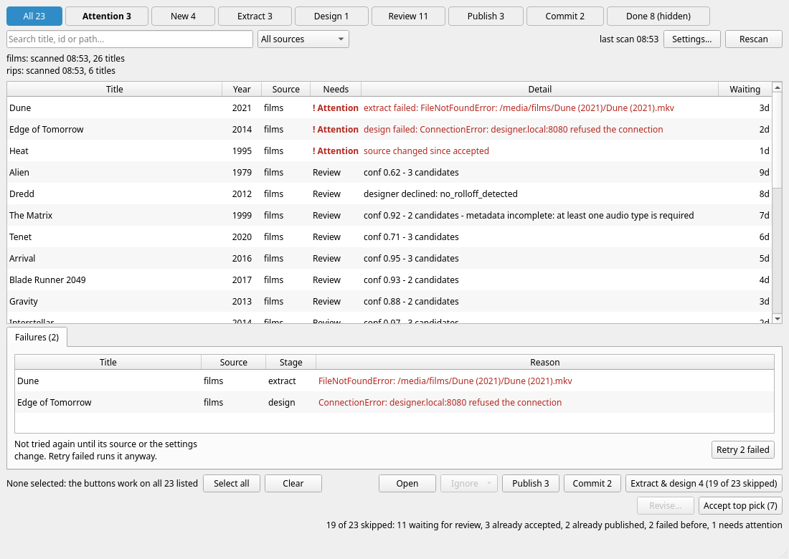

**Discovery** is finding out what is in the library and what each title needs, without doing any of the work. It is cheap, so you can do it whenever you like.

### What a scan does

A scan (the **Rescan** button) does four things:

1. It lists every [source](setup.md#sources) in the profile.
2. It merges the lists: the same file in two sources becomes one title, and titles you have chosen to [ignore](setup.md#ignore) are marked.
3. It reads what already exists for each title: the extraction in the work directory, the review entry, the `.beq` projects, and the state of your XML and images repositories.
4. From those it works out what each title needs next, and stores the answer in the discovery index in the work directory.

A scan **never extracts audio, never designs and never publishes**, and it **never reads a movie file**. A JRiver source is listed with a single request to the server, which is why it does not matter how large the library is. A filesystem source costs, at most, a look at the size and date of each file. Whether a JRiver file exists on this computer is not checked during a scan either: if a path mapping is wrong you find out when extraction fails, with the reason.

The result is a **cache**. You can delete `library-index.sqlite` from the work directory at any time; the next scan builds it again and nothing else is lost.

### When it happens

* **When you open the window for the first time** (or the index is missing), the list is scanned by itself. Otherwise the window shows the last scan immediately and does not rescan. *last scan 08:53* (or a date, if it was not today) at the top right says how old it is.
* **When you press *Rescan*.** It scans in the background: the button reads *Scanning...*, a progress bar appears at the bottom of the window and the list stays usable. It scans every source; there is no button to rescan just one. A scan cannot be cancelled, and *Rescan*, the action buttons and the settings are disabled until it finishes.
* **Whenever you change something that affects the answer**, a banner offers *Rescan now*. See [the settings drawer](setup.md#the-settings-drawer).

After a scan that found new titles, the *New* button on the strip counts them, they are tinted in the list and their *Waiting* column reads *new · 4h* (*new*, then how long the title has been in its current state). *New* means first seen by the **most recent** scan, so a title stays new until the next scan.

### Reading the list

The columns are **Title**, **Year**, **Source** (the source that owns it), **Needs**, **Detail** and **Waiting**. *Detail* is the one-line reason for the need (for example *conf 0.62 - 3 candidates*, or the error for a failure), followed by any [flags](#flags). *Waiting* is how long the title has been in its current state: `now`, `5m`, `3h`, `9d`, `4mo`, `2y`. Hover over a cell for more: a title's tooltip shows its path and id and which other sources also have the file.

The order is **tier first** (attention, then review, then the machine work, then done), and **oldest first within a tier**, so what has waited longest is at the top. Click a column heading to sort by it, click it again to reverse, and a third time to go back to the default order.

To narrow the list:

* the **strip** of buttons filters by need: *All*, *Attention*, *New*, *Extract*, *Design*, *Review*, *Publish*, *Commit*, *Done*. The number on each is how many titles it would show. *Done* is hidden until you press it (it reads *Done 8 (hidden)*), so finished work never crowds out what is left. See [Concepts](concepts.md#needs-and-tiers).
* the **search box** (`Ctrl+F` puts the cursor in it) matches part of a title, its id or its path, ignoring case. It does not search the *Detail* column, so it cannot find titles by their flags.
* the **source** drop-down shows only the titles that one source owns. A source that could not be listed is marked with `(!)`.

The strip's numbers follow the search and the source: search for `alien` and each button counts only matching titles.

### Flags

Some titles carry a label. It is shown at the end of the *Detail* column.

| Flag | Meaning | Needs |
|---|---|---|
| **Ignored** | an [ignore rule](setup.md#ignore) or you have ignored it; the detail names the rule (*ignored by rule: year <1960*) or says *ignored by you* | Done |
| **Shadowed** | the same file is owned by a higher-priority source; the detail names the owner | Done |
| **Gone** | the title has left its source (the file was removed from the library) but it has outputs, so it is kept rather than deleted. Nothing is ever deleted automatically | Done |
| **Superseded** | the detail says *superseded by ...*: the title's files are still listed but are now grouped under another title, which happens when you change the [TV mode](setup.md#locations). A row that already has a review entry is kept, so you can finish it | as it was |
| **Possible duplicate** | another title has the same TMDB id, IMDb id or title and year, in a different file. Both stay in the list | as it was |
| **Already in catalogue** | the title's TMDB id already appears in the XML repository under a file that *this* profile did not publish (someone else's, or an older filter). It is a label only: the title stays in the list, and you can ignore it if you want | as it was |

!!! note
    There is no filter for *Possible duplicate*, *Already in catalogue* or any other flag. To find them, look at the *Detail* column, or in the *Done* view for the ones that are Done.

### A source that cannot be read

If a source cannot be listed (a server is down, a network share is not mounted), the scan does not lose its titles. It keeps the last listing and says so in red under the strip:

> films: could not be listed (why). Showing its listing from 09:14.

The same happens if a source that listed some titles last time now lists **none**: an unmounted share looks like an empty library, so the previous listing is kept and the scan reports it. There is no way to say "it really is empty" in the work list (the command line has `scan --allow-empty` for that).

With more than one source, a line per source (*films: scanned 08:53, 26 titles*) is always shown under the strip.

### Nothing is shown

An empty list explains itself. It says the library is not set up yet (and what is missing), that it has not been scanned yet (press *Rescan*), that the last scan found no titles (check the sources), that nothing matches your search, or that there is nothing in that view.
