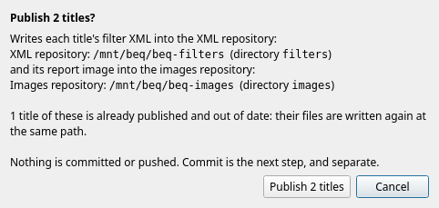
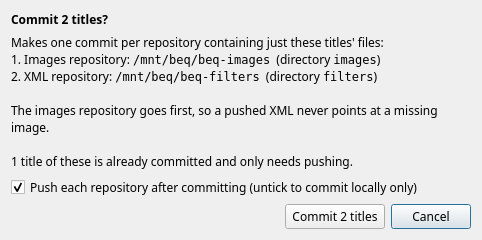

Once you have accepted a title, two more steps put its filter into your catalogue. They are separate on purpose, so that you can look at what was written before anything is committed or pushed.

| Step | Button | What it does | Where |
|---|---|---|---|
| **Publish** | *Publish N* | writes the filter XML (and report image) into the **working trees** of your local repositories | files on your disk only |
| **Commit** | *Commit N* (or *Push N*) | commits those files and pushes them | your git history, and the remote |

Both are buttons under the work list, and both need an **XML repository** to be set in [Settings > Locations](setup.md#the-two-repositories). Without one, the buttons are disabled and their tooltip says *No XML repository is set. Set one in Settings (Locations).* They work on the titles you have selected, or on everything the list shows if you have selected none, like the [other buttons](work.md#what-the-buttons-work-on), and only on the titles whose need is exactly that: *Publish* never extracts anything and *Commit* never publishes anything. In the [Review Folder](review.md#review-folder) window, the same steps are the buttons *Publish accepted* and *Commit published*.

### Publish

*Publish N* asks first, naming exactly where it will write:

For each accepted title it writes:

* `<XML folder>/<id>.xml` in the XML repository: the filter, and the metadata you reviewed, and, if an images repository is set, the address of the image;
* `<Images folder>/<id>.png` in the images repository, if there is one: the report image, made of the chart, the filter and the artwork.

The filter is the one in the title's [`.beq` project](review.md#projects), so a hand edit is what ships, not the designer's candidate. The file name comes from the title's id, which does not change, so publishing again always writes the same file.

Publishing changes nothing but files in the working trees. The title moves from *Publish* to *Commit*.

**Each title stands alone.** If one cannot be published, it is refused with a reason (incomplete metadata, the mono and multichannel projects disagree, git refused) and the others carry on. Refused titles keep their status, so they can be published later once fixed. The reasons are on the *Last run* tab.

**Published titles that changed.** If you fix the metadata of a title that is already published, change its artwork or edit its project, it needs *Publish* again (*changed since it was published*) and no second review. Selecting it and pressing *Publish* writes it again to the same path. The same is true of a title whose XML has gone missing from the repository. Publish's confirmation says how many of the titles are being written again.

!!! note
    If you change the *XML folder* or the *Images folder* in the settings, new files are written at the new place, and the files at the old place are **not** removed: that is left for you to do.

### Commit

*Commit N* also asks first:

It makes **one commit per repository** that contains only the files of the titles concerned, and then **one push per repository**. The **images repository goes first**, so a pushed XML never refers to an image that has not been pushed yet. Anything else you happen to have staged in the clone is left alone, and if there is nothing new to commit that is not an error.

* The commit message summarises the titles, for example *Publish 3 BEQ filters: Fury, Moon, Speed* (and *Publish 3 report images: ...* in the images repository); a long list is cut after eight titles.
* **Push each repository after committing** is ticked by default, and remembered. Untick it to commit locally and push later. The titles then still need *Commit* (*committed, not pushed*), and the button reads *Push N*, whose confirmation says only pushing will happen.
* git is run as you: it uses your git identity, credentials and SSH configuration, so a push works if it works from a terminal in that clone. A rejected push is reported with git's message, the commit is kept, and pressing the button again tries the push again.
* *Cancel* can stop a publish between titles, but **a commit cannot be stopped part way**. A cancelled run never commits.
* Whether a file is committed or pushed is read from git each time, not remembered, so a commit you made by hand is respected.

A title that has been pushed is **Done**.

### Revisions

A title that is already committed or pushed can still change. When you [revise](revise.md) it, or edit its metadata, and publish it again, **the same file is rewritten and committed again**: in git it is a new revision of the same path, not a second file. Reopening a title that was only published (not yet committed) takes its files out of the working trees again.

### The results

When a publish or commit finishes, the *Last run* tab lists each title (*Published*, *Republished*, *Refused*, *Committed*, *Pushed*, *Git failed*) and one line per repository with the commit and whether it was pushed. Select a line to read the whole of a long git message. A summary such as *Commit finished: 3 committed, 3 pushed* is shown in the line above the buttons.

If the images repository is not on github.com, the address of a report image cannot be worked out, and each title says so. Set **Image owner** and **Image repository** in [Settings > Locations](setup.md#locations).
