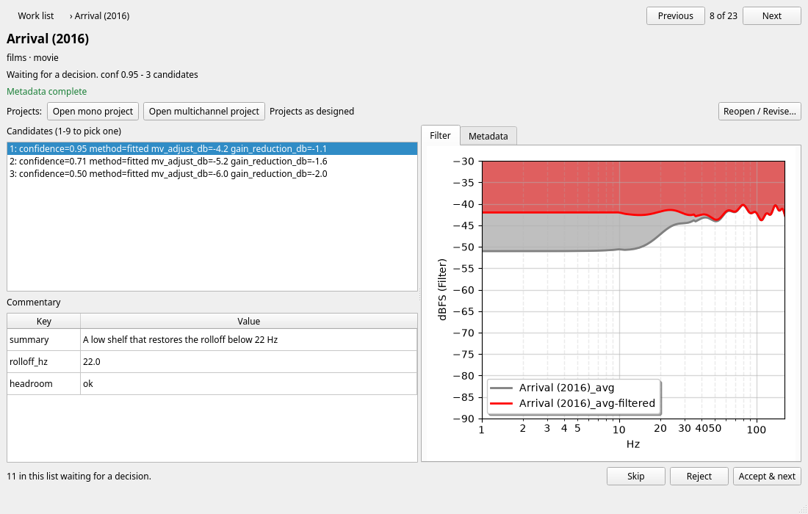
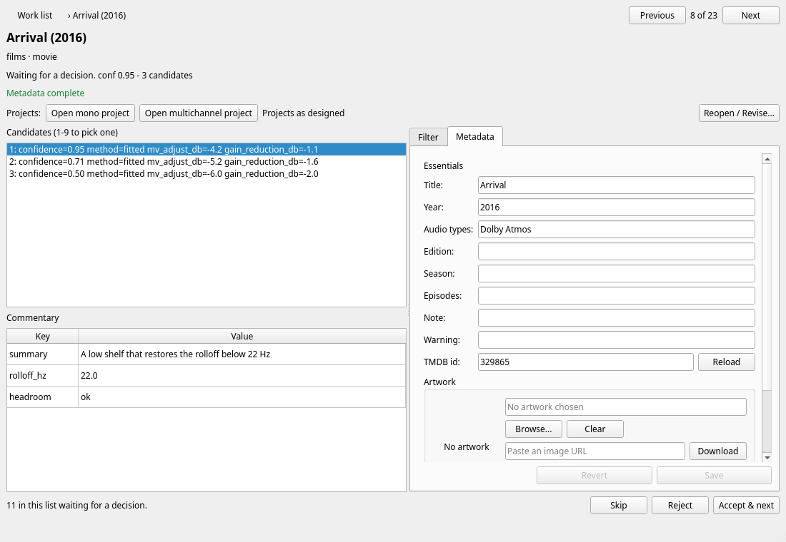
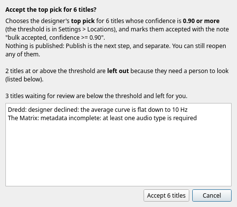
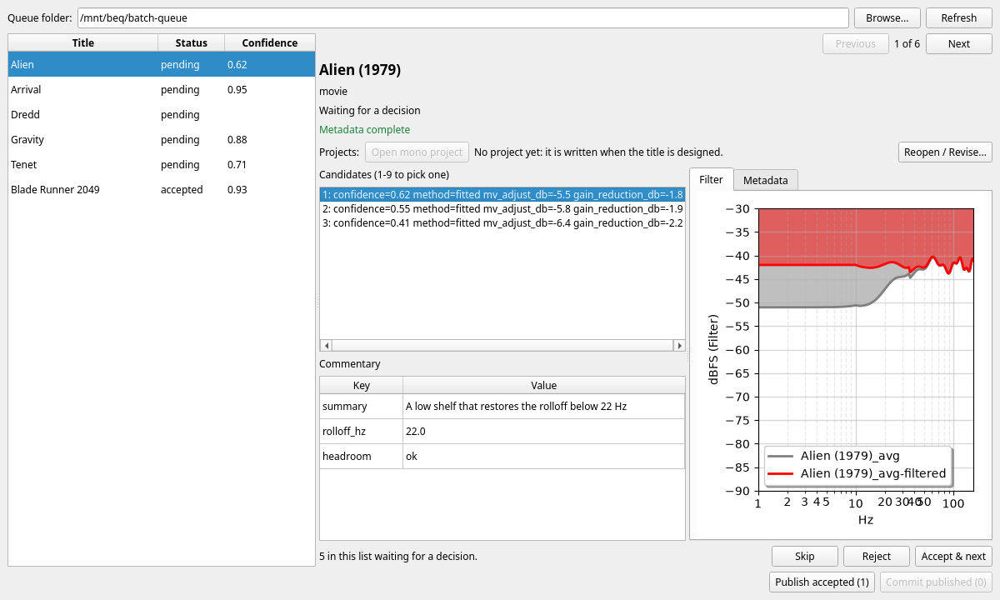

Review is where you decide. For each designed title you look at the candidate filters, choose one (or skip or reject the title), and make sure the metadata is right. Nothing is published without this step.

There are three ways to reach it:

| Way in | For |
|---|---|
| **The Library Work List** | titles that came from the library. Double click a title, or select it and press *Open* (or `Enter`) |
| **`Tools > Review Folder...`** | any folder of review entries, without a library: for example the designs that a [Batch Extract](../ui/batch_extract.md) run wrote. See [Review Folder](#review-folder) |
| **Hand-over from Batch Extract or Extract Audio** | these open the Review Folder window for you when their designs are done. See [Review Folder](#review-folder) |

They are the same page and behave the same way. Only what surrounds the page differs.

### The title page

In the work list, opening a title replaces the list with the **title page** in the same window. Press `Esc` or the *Work list* button in the top left to go back: the list is as you left it, with your selection, scroll position and filters intact.

At the top is the title and year, its source, and a line saying where it is (*Waiting for a decision. conf 0.95 - 3 candidates*). Under it is a badge that says whether the metadata is complete enough to publish (*Metadata complete*, or *Not ready to publish: year is required*). On the left are:

* **Candidates**: the filters the designer proposed, best first, each with its confidence, method and the gain change it implies. The highlighted one is the one that will be accepted. Press `1` to `9` to pick one, or click.
* **Commentary**: what the designer said about the highlighted candidate.

On the right, the **Filter** tab draws the audio track's average (solid) and peak (dashed) curves in grey, and both with the highlighted candidate's filter applied in red. Older review entries that saved only the average curve show that curve alone until the title is designed again. The **Metadata** tab is [described below](#metadata-and-artwork).

*Previous* and *Next* (`Alt`+`Left`, `Alt`+`Right`) step through the titles the list was showing when you opened the page, and *8 of 23* says where you are. The list is a snapshot: a title that changes while you look is still reached by *Next*.

#### Deciding

| Button | Key | Effect |
|---|---|---|
| **Accept & next** | `A` (or `Enter` while the candidate list has the focus) | accepts the highlighted candidate and goes to the next title that is waiting for a decision |
| **Skip** | `S` | leave it for later: it goes to *Done* and stays out of the catalogue |
| **Reject** | `R` | none of the candidates is right: the title is not published |

* **Accepting publishes nothing.** It records your choice. The title then needs *Publish*.
* *Accept & next* goes on to the next waiting title after this one, and wraps round to the start when it gets to the end. When none are left it stays where it is and says so.
* Accept is **switched off while the metadata is incomplete**, and the line under the candidates says what to fill in. Pressing `A` then shows the *Metadata* tab and outlines the missing box (the keyboard stays where it was).
* Accept is also not offered for a title that has to be extracted or designed again first, or that has failed, and a title that the machine is working on right now can not be decided.
* If the designer **declined** a title, there are no candidates, and you can skip or reject it.
* Skip only applies to a waiting title. A *skipped* title can still be accepted or rejected later: open it from the *Done* view. To undo an accept, use [Reopen](revise.md).
* Before it writes a decision, the page reads the title's entry again. If it changed since you opened it (a run redesigned it, or it was decided elsewhere) nothing is written, and the page shows what is there now.
* The keys work anywhere on the page **except in a text box**, where they type. `Enter` does nothing outside the candidate list, so pressing it in a field never accepts a title. `Esc` in a field returns to the candidate list, and a second `Esc` goes back.
* A decision is not shown in the work list's counts until you leave the page: the list catches up when you press *Work list*.

### Metadata and artwork

The **Metadata** tab is the same information as appears in the published XML. **Essentials** are:

* **Title**, **Year** and **Audio types** (separated by commas, for example `Dolby Atmos, DTS-HD MA 5.1`) are required. At least one audio type must be given.
* **Edition**, for example *Director's Cut*.
* **Season** and **Episodes** for a TV title (for example `1-8`, or `1-3, 5`). Changing the season or the TMDB id drops the TMDB season details a run looked up.
* **Note** and **Warning**, shown with the filter in the catalogue.
* **TMDB id**, with **Reload**: with an id, Reload fetches that title. Without one it searches by title and year (as a series if a season is given). It fills in only what TMDB returned (title, year, rating, runtime, ...), never audio types, and nothing is saved until you leave the field. *Revert* undoes it.

**More** (collapsed) holds the rest, none of it needed to publish: alternative title, sort title, language, source, rating, author, AVS post URL, runtime, gain and genres. A blank *Language* or *Source* means the default from the profile's `sync.meta_defaults`, else *English* and *Disc*. A blank *Gain* means the chosen candidate's.

**Artwork** is the poster used in the report image. *Browse...* takes a PNG or JPEG from your computer (the file is used where it is, not copied, so do not move it), *Download* fetches an image URL into the queue directory, and *Clear* forgets the current choice (a later run may pick one again).

Things worth knowing:

* **Edits are saved for you** when you leave a field, when you move to another title, when you decide and when you leave the page. *Save* and *Revert* exist for when you want to be sure. Nothing you type is lost silently: if an edit cannot be saved (episodes that are not numbers, say) the page stays where it is and says why, and *Skip* or *Reject* offer to discard it.
* **You can edit any title**, whatever its status, including a title that is already published. A change to a published title makes it need *Publish* again (*changed since it was published*), with no second review, so a typo in a title's year can reach the catalogue without you reviewing it again. A change that makes an accepted title incomplete sends it back to *Review*.
* **A blank box removes that value**, so the default applies again.
* The badge and the *Metadata* tab agree with the work list: *Metadata !* on the tab means the metadata is incomplete.

### Projects

Designing a title writes a **mono project** (and a **multichannel project**, if you [keep the multichannel extraction](setup.md#locations)) into the title's folder in the work directory, as `<id>.mono.beq` and `<id>.multichannel.beq`. They are ordinary [project files](../ui/load_save.md), the same as *File > Save Project* writes, and the filter in them is the designer's top pick.

New multichannel projects group the linked channels in a bass-managed track, so the main window can calculate their sum. The project uses the bass-management low-pass settings in Preferences (or the app defaults for a headless library run). Older multichannel projects still open and publish.

**What you save in the project is what is published.** So if you want to change a candidate by ear or by eye, open the project, change the filter in the main window, and save it over the same file.

* **Open mono project** and **Open multichannel project** (the second only for a title that has one) load the file into the main window, as *File > Load Project* would. If the main window already holds signals, you are asked first, because they are replaced. The button is disabled if the file does not exist yet or cannot be read.
* Save the project over the same file (*File > Save Project* offers it) and come back to the work list. The badge next to the buttons updates when the window becomes active again.

The badge says what state the projects are in:

| Badge | Meaning |
|---|---|
| Projects as designed | the filter is what the designer wrote |
| Modified since design: mono project | the filter in the project differs from what the designer wrote |
| No project yet | a title with nothing designed yet |
| The mono project could not be read | the file is damaged; the reason is shown |

!!! warning
    A project counts as **modified since design** if it has been opened and saved again from the main window, **even if you changed nothing**. BEQDesigner recognises its own projects by a stamp that the main window's *Save Project* does not write. If you only wanted to look, do not save.

What "modified" means for the title (the badge's tooltip says it too):

* an accepted or published title becomes *Publish: out of date*, so that the edited filter reaches the catalogue;
* a redesign keeps your edit, and does not overwrite the project;
* [bulk accept](#bulk-accept) leaves the title out;
* if the mono and the multichannel projects are both edited and now disagree, the title needs **attention**, because it is not clear which one to publish.

### Bulk accept

When many titles are waiting and most are confident, you can accept the designer's top pick for all of them in one go. The **Accept top pick (N)** button under the list does this for the selected titles, or, with none selected, for the whole view. *N* is the number of titles waiting for review whose top pick is at or above the **accept threshold**, which is in [Settings > Locations](setup.md#locations) and is 0.90 unless you change it.

**Nothing is accepted without a confirmation.** It says how many titles will be accepted, at what confidence, and which titles are **left out and why**. A confident title is left out if:

* its **metadata is incomplete**,
* the designer **declined** it,
* its **project was edited** since it was designed (the top pick is no longer what would be published), or
* it has no review entry.

Titles below the threshold are counted and left for you. Each title that is accepted gets the reviewer note *bulk accepted, confidence >= 0.90*, so you can see later how it was accepted. The button's count is worked out from the list, so it can be a little higher than the number in the confirmation, which also applies these checks.

After it runs, the *Last run* tab lists every title that was accepted and every title that was left out with its reason, and the message says *They now need Publish*. Nothing has been published: that is the next step. You can [reopen](revise.md) any of them.

### Review Folder

`Tools > Review Folder...` opens a window for reviewing **a folder of review entries**, without a library. It is what you use after [Batch Extract & Design](../ui/batch_extract.md) or the [Extract Audio](../ui/extract_audio.md) design step, whose results are not part of any library.

The window has the title page on the right, exactly as above, and on the left a list of the entries in the **Queue folder** with their *Status* and *Confidence* (pending ones first). *Browse...* chooses another folder (it is remembered) and *Refresh* reads the folder again, for example after a Batch Extract run has written more. Press `Enter` in the list to move to the candidates.

* **The hand-over.** Batch Extract & Design opens this window on its queue directory by itself when all its designs have finished. Extract Audio asks *Open it for review now?* when its design has finished.
* **Entries from Batch Extract and Extract Audio have no metadata and no project.** They know the file's name and nothing else, so the title is shown as the file name and *Accept* is switched off. Fill in the title, year and audio types on the *Metadata* tab (*Reload* asks TMDB) before you accept. The page says *No project yet* for these.
* **Publish accepted (N)** and **Commit published (N)** at the bottom right publish and commit exactly as the work list does, [with the confirmations described there](publish.md), and use **the repositories of your library profile** (the ones in the work list's [Settings](setup.md#the-two-repositories)). Set those first. An entry that also has a folder in that profile's work directory (because the work list designed it) is published from its `.beq` project, so a hand edit is what ships; one designed by Batch Extract has none and is published from the candidate you accepted.
* There is no discovery here, so no *Needs*, no scanning and no running: a folder is not a library. It also has no *Ignore*, no *Retry failed* and no *extract only*. *Reopen / Revise...* works, but *Redesign* means running Batch Extract & Design on the title again and pressing *Refresh*.
* Only one Review Folder window is used at a time, and it is shown again when you open it from the menu or from a run.
