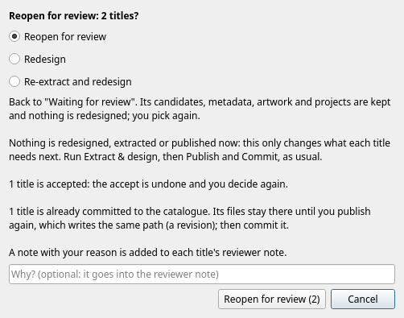

A title that is finished is not finished for ever. You might have accepted the wrong candidate, or a better designer might be available, or the wrong audio track was extracted. **Revising** sends titles back.

You do **not** need to revise a title just to fix its metadata or to tune its filter: [edit the metadata](review.md#metadata-and-artwork) or the [project](review.md#projects) directly, and a published title then simply needs *Publish* again, with no second review. Revise is for changing a *decision* or redoing work.

### How to revise

* On the [title page](review.md#the-title-page), press **Reopen / Revise...** to send back the title you are looking at.
* In the work list, select the titles (in any view, including *Done*) and press **Revise...** under the list. It works **only on the rows you have selected**, never on "everything listed", so that it cannot be pressed by accident over a whole library.

You are asked how far back to send the titles, and you are told what will happen **before anything changes**. Each choice includes the one before it.

| Choice | What it does | Use it when |
|---|---|---|
| **Reopen for review** | back to *Waiting for review*. Its candidates, metadata, artwork and projects are kept | you want to pick again, or an accepted title needs another look |
| **Redesign** | as reopen, and the design is marked out of date, so the next *Extract & design* designs it again. What you set is kept: metadata, artwork, your notes and any edit you made to a project | there is a better designer, or the analysis settings changed |
| **Re-extract and redesign** | as redesign, and the extracted audio is forgotten, so the next run extracts it again with ffmpeg | you need a different audio stream, or the extraction was wrong |

You can also give a **reason**. It is added to each title's reviewer note.

!!! info
    **Revising only changes state.** Nothing is redesigned, extracted or published at that moment. The titles then need that work like any others, and you run *Extract & design*, review, *Publish* and *Commit* as usual. A title sent back for redesign or re-extraction shows as needing *Design* or *Extract* after the list catches up (a bulk revise reads the outputs again at once; on the title page, when you leave it), and it cannot be accepted until it has been designed again.

### What happens to its files

What it means depends on how far the title had got, and the question says so for the titles you have chosen:

| The title is | Revising |
|---|---|
| waiting for review, or has nothing designed yet | it is left as it is |
| accepted | the accept is undone, and you decide again |
| published, but not committed | the files written for it are taken out of the repositories' working trees again (deleted, or put back as last committed) |
| already committed (or pushed) | its files stay where they are until you publish again, which writes **the same path**: a [revision](publish.md#revisions), which you then commit |

Published titles need the **XML repository** to be set (and the images repository, for the image) so that their files can be dealt with. If a choice cannot be carried out, the reason is shown in the dialog and the OK button is disabled: no review queue directory is set, nothing has been designed, the titles are already waiting (for *Reopen*), a published title has no XML repository, or there is no work directory for a re-extract.

A few more rules:

* Nothing is revised while a **run is working on it**. An accepted or published title is not revised while a **publish or commit** is running, because the repositories are in use.
* A title that cannot be revised is reported by name on the *Last run* tab (*Not changed*, with why) and the others are still revised. When it works, each line reads *Reopened*, *Sent back for redesign* or *Sent back for re-extraction*.
* **Re-extract does not forget a TV season's episodes.** With one filter per season, the extractions of the episodes are kept, and only the joined track is forgotten, so the season is rebuilt from the episodes' existing audio unless one of their source files changed.
* Re-extract forgets the record of the extraction. It does not delete the audio files.

### The "settings changed" banner

A change of settings, such as another designer, or another analysis setting, does not send finished titles back by itself: that would put your whole library in the list at once. Instead the work list shows a single banner:

> The settings changed since 12 accepted or published titles were designed. They keep the old design until you revise them.

*Revise...* on the banner opens the same question, over exactly those titles, starting on **Redesign**. *Dismiss* hides the banner until the set of titles changes. It counts accepted and published titles whose design was made under other settings. It does not count seasons, or titles designed before this was recorded, and a title whose *source* changed is not counted here, because it already needs attention.

A title revised from the banner needs *Design* once the list has caught up, and is designed again by the next *Extract & design*.
