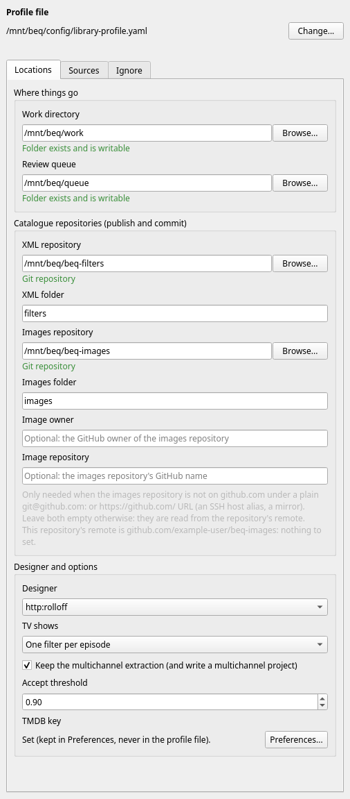
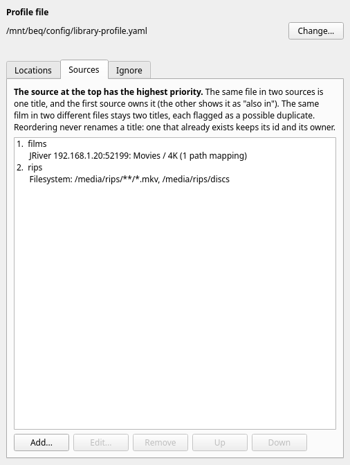
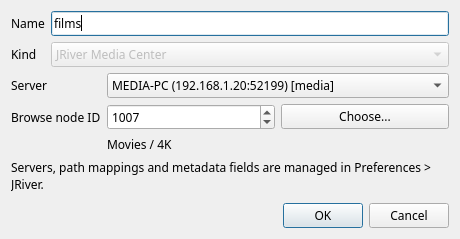
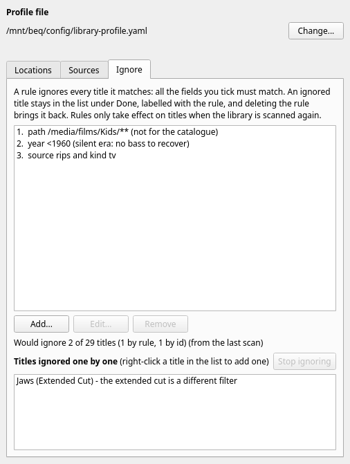

Everything one catalogue needs is kept in a single file, the **profile**: where the library is, where the work goes, which repositories to publish to, which designer to use and what to ignore. You edit it through the **settings drawer** in the work list. You do this once, and again when something changes.

### Before you start

* Add a designer in [Preferences > Designers](../ui/preferences.md#designers). It is chosen in the profile, and a scan cannot run without one.
* If your library is in JRiver Media Center, add the server in [Preferences > JRiver](../ui/preferences.md#jriver) first, together with its path mappings.
* If you want to publish, have a local clone of your XML repository (and, optionally, of an images repository). BEQDesigner writes into and commits to them, it does not clone them for you.
* Make sure [ffmpeg is installed](../ui/preferences.md#binaries). The *Extract & design* button checks for it and tells you if it is missing.

### The profile file

The profile is a YAML (or JSON) file. The work list knows which file it is using through a setting in Preferences, so you never have to remember it, but it is an ordinary file that you can back up and keep in version control.

**The first time.** If you have never made a profile, the settings drawer says *These settings come from the saved library preferences. The first change you make here creates a profile file for them.* (If you used the old *Library Sync* dialog, which the work list replaced, the starting point is what that dialog saved: one source, the work and queue folders, the repositories and the designer. Otherwise it is empty.) The first change you make opens a save dialog, **Library profile file**, and offers a file called `library-profile.yaml` in the application's configuration folder. That folder is deliberate: the work directory is where you might clear space, and the profile is the one thing you must not lose. If you cancel, nothing is saved and your edit is taken back.

**Changing the file.** *Change...* at the top of the drawer switches to another file. If the file exists it is read, and if the name is new, the current settings are written to it.

Things to know about the file:

* **Only what the drawer manages is changed on save.** Anything else in the file, for example a `designers:` section, other keys under `run:` or `sync:`, or settings the drawer does not offer (`meta_defaults`, `audio_types`, `commit_message`) is kept exactly.
* **Comments in a hand-written YAML file are lost** the first time the drawer saves it, because it is rewritten from the settings. Everything else is kept.
* **The JRiver password ends up in the profile file.** When you add a JRiver source, the server's login, path mappings and metadata fields are copied from Preferences into the source, so the file is complete on its own (and can be used by [the command line](unattended.md)). Treat the file like any other place a password is stored. The TMDB key is *not* in the file.
* If you edit the file by hand, choose `Tools > Library Work List` again (or *Change...*) and it is read again. A file that cannot be read is reported by the window with the reason, and the drawer is disabled until you fix it or choose another file.
* The file format is described for developers in the [pipeline README](https://github.com/3ll3d00d/beqdesigner/blob/main/src/main/python/pipeline/README.md#one-catalogue-from-several-libraries-a-profile).

### The settings drawer

Press *Settings...* in the work list (or *Settings...* in the banner that appears while the setup is incomplete). The drawer opens beside the list, on the right, and the list stays usable. It has three tabs: **Locations**, **Sources** and **Ignore**.

* **Every edit is saved for you** a moment after you make it. There is no Save button. *Saved 09:14:02* appears at the top when it has been written.
* **An edit that cannot be used is not applied.** The reason is shown beside the field (or as *Not saved: ...* at the top) and the file is left alone.
* The drawer is disabled while a scan or a run is going, and says so.
* If the setup is incomplete, a banner at the top of the work list says what is missing (no source, no work directory, no queue directory, no designer) and the *Rescan* button is disabled until it is fixed.
* After you change a source, an ignore rule, or a setting that changes what a scan concludes, a second banner says *The settings changed since the last scan, so this list may be out of date* with a *Rescan now* button. The list is **not** rescanned automatically, because a big JRiver library can take a while and people usually change several things in a row.

### Locations

**Where things go**

* **Work directory**: where extracted audio, `.beq` projects and the discovery index go. It must exist and be writable. If you type a folder that does not exist yet, the drawer creates it.
* **Review queue**: where designed titles wait for review, and where your decisions are kept. This is the same folder that [Batch Extract](../ui/batch_extract.md) and [Review Folder](review.md#review-folder) use.

**Catalogue repositories (publish and commit)**

* **XML repository** and **XML folder**: a local git clone, and the folder inside it that filters are written to (empty means the top folder). Each is checked when you enter it: *Git repository* is shown in green when it is one. This is the only repository you must set to publish.
* **Images repository** and **Images folder**: optional. If set, a report image is written for each title and the XML refers to it.
* **Image owner** and **Image repository**: usually leave these empty. They are needed only when the images repository is not on github.com under a plain `git@github.com:` or `https://github.com/` address (an SSH host alias or a mirror), because the address of the image is worked out from the remote. The note under the fields says whether your repository's remote was recognised.

See [the two repositories](#the-two-repositories) below.

**Designer and options**

* **Designer**: the designer to ask for candidate filters. The list is the designers from [Preferences > Designers](../ui/preferences.md#designers) (shown as `http:<name>`) plus any declared in the profile. A name the profile uses that is not available is shown as *name (not available)*.
* **TV shows**: *One filter per episode* or *Whole season as a single track*. See [Concepts](concepts.md#titles).
* **Keep the multichannel extraction (and write a multichannel project)**: also keep a multichannel WAV at the analysis sample rate, matching Batch Extract / Design, and write a second project in which the filter is linked across every channel. This is enough for the project's BEQ curves and avoids reloading and downsampling a full-rate soundtrack when the project opens. Off by default.
* **Accept threshold**: the confidence at or above which [bulk accept](review.md#bulk-accept) will take a title's top pick. Default 0.90. This is a preference of this installation, not part of the profile.
* **TMDB key**: whether a [TMDB](https://www.themoviedb.org/) key is set. It is used to fill in titles, years and other metadata, and is kept in Preferences and never in the profile. The button opens Preferences, but note that the Preferences dialog has no field for it: BEQDesigner has a built-in key, which you can override by setting the `BEQDESIGNER_TMDB_API_KEY` environment variable before starting the application.

### Sources

A **source** is somewhere movie files are listed from. You can have several, for example a JRiver Media Center library and a folder of ripped discs, and the catalogue is the union of them.

There are two kinds, chosen when you add a source with *Add...*:

* **Filesystem**: one or more folders or globs, one per line, for example `/media/rips/**/*.mkv`. A folder on its own means everything directly in it (not in its sub-folders), so use `**` to go deeper. Only media files (video and audio extensions) are taken. A folder that is a Blu-ray rip (it holds `BDMV/index.bdmv`) or a DVD rip (it holds `VIDEO_TS/VIDEO_TS.IFO`) is one title. A filesystem title's id comes from its path, so a moved or renamed file is a new title.
* **JRiver Media Center**: a server (chosen from the ones in [Preferences > JRiver](../ui/preferences.md#jriver)) and a **browse node**, the part of the library that is the catalogue. The default, `-1`, is the whole library. Press *Choose...* to pick a node from the server's browse tree. A JRiver title keeps its id when the file is renamed or moved.

Every source has a **name**, unique in the profile, which appears in the *Source* column of the work list and in the source drop-down. A new source is named after its kind, and you can change it. Renaming a source updates the ignore rules that name it.

The list is in **priority order**: the top one has the highest priority. Drag a source to reorder it, or select it and use *Up* and *Down*. A new source is always added at the bottom, so it cannot take over titles that already exist. Double click (or *Edit...*) edits a source, and *Remove* removes it without asking.

!!! warning
    A source's kind cannot be changed after it is added: add a new source of the other kind instead. For a JRiver source the browse node id is the first thing in the dialog, and the readable path (*Movies / 4K*) is shown beneath it as a label after you choose one. The list of servers, path mappings and metadata fields lives only in Preferences > JRiver, not in this dialog.

A JRiver source keeps its **own copy** of the server's login, path mappings and metadata fields, taken from Preferences when you add the source. Editing the mappings in Preferences later does not change a source that already exists. When you edit a source whose copy differs from Preferences, the dialog says so and offers *Use the login and mappings from Preferences* to take the current ones.

#### When two sources have the same title

Two kinds of overlap are handled differently.

* **The same file in two sources is one title.** "Same file" means the same path after the JRiver path mappings are applied, ignoring upper and lower case and `/` against `\`, and with a disc's clips counted as the disc folder. The higher-priority source owns the title. The other copy is *shadowed*: it appears under *Done*, labelled *Shadowed*, with the id of the title that owns it, and the owner's row records that the file is also in the other source (see its tooltip). Nothing is read from the disk to decide this.
* **The same film in two different files is not merged.** It might be a real second entry (another edition, another audio track), so both stay titles and both are flagged **Possible duplicate**. Same means the same TMDB id, else the same IMDb id, else the same title and year. You decide what to do with them, for example by [ignoring one](#ignore).

**A title keeps its owner.** Reordering the sources does not move titles between them: once a title exists (it has a review entry or a work folder), the source it came from keeps it whatever the order, so an expensive extraction is never orphaned and a second XML is never published for the same film. If the owning source stops listing the file, the other source takes over under its own id, and the old title's outputs are left behind.

### Ignore

Some things in a library are not for the catalogue: children's films, TV, silent films, trailers. An **ignore rule** takes them out of the work. A title that is ignored stays in the list, under *Done*, labelled with the rule that ignored it. Deleting the rule brings it back at the next scan.

A rule says which fields it constrains, and **all** the ticked fields must match:

| Field | Matches | Example |
|---|---|---|
| Source | the source that owns the title | `rips` |
| Path (folder or glob) | the file's path, or any folder above it. `*`, `**` and `?` are wildcards; `[` and `]` are ordinary characters | `/media/films/Kids/**` |
| Title matches | a regular expression, tried on the first 300 characters of the title | `^Trailer` |
| Year | one year, or `<1960`, `>=1999`, `1990-1999` | `<1960` |
| Kind | `movie` or `tv` | `tv` |
| External ids | `imdb=tt0113277, tmdb=603` | |
| Reason | optional; shown wherever the rule is named | |

The rule editor (*Add...*, or *Edit...* on a rule) shows an error under the fields as you type, and *OK* is disabled until the rule is valid. It also shows **how many titles the rule matches** and how many all the rules together would ignore, *from the last scan*, so you can check a rule before it does anything. Rules only act on titles when the library is scanned again. The count is worked out from the rows of the last scan, so it says when it cannot judge something, for example a title with no year cannot match a year rule.

To ignore one title (or a few) rather than a pattern, select it in the work list and use the **Ignore** button under the list (or right click the row):

* **Ignore titles like this...** opens the rule editor filled in from that title (its folder, kind, year, title and source), with only the folder ticked, so you can widen or narrow it. *Ignore just this title* in that dialog ignores the one title instead of writing a rule.
* **Ignore this title...** ignores every selected title, asking for an optional reason.

Titles ignored one by one are listed at the bottom of the *Ignore* tab, where *Stop ignoring* takes one back.

### The two repositories

Publishing writes into the local clones of two git repositories. You publish to the same layout as the community BEQ catalogues, and they are ingested by [BEQCatalogue](https://beqcatalogue.readthedocs.io/en/latest/), which finds every `.xml` file in the XML repository.

| Repository | What is written | Required? |
|---|---|---|
| XML repository | `<XML folder>/<id>.xml`, the filter and its metadata | yes, to publish |
| Images repository | `<Images folder>/<id>.png`, the report image | no |

Images belong in a **separate repository** from the XML, and the XML refers to each image by its address on github.com, which is why the images are committed and pushed first. See [Publish and commit](publish.md) for what happens.
