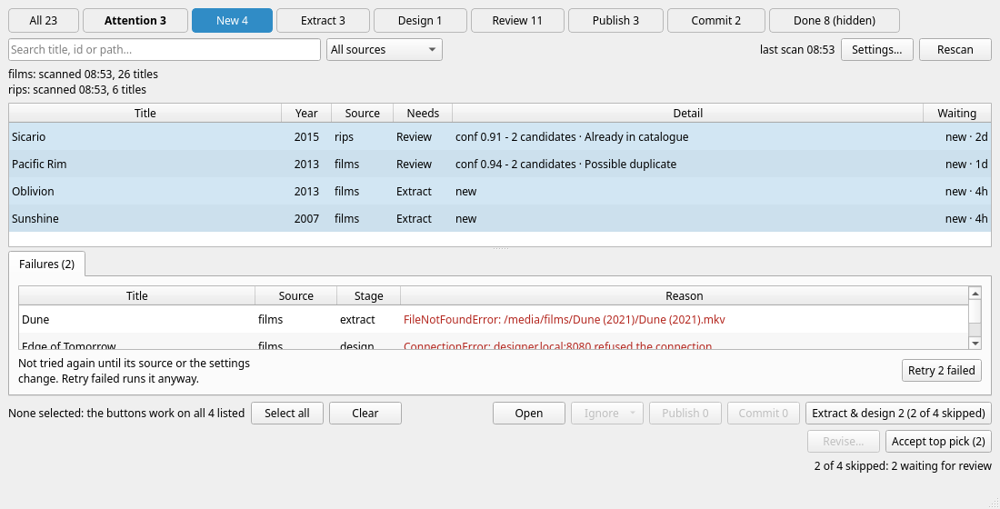
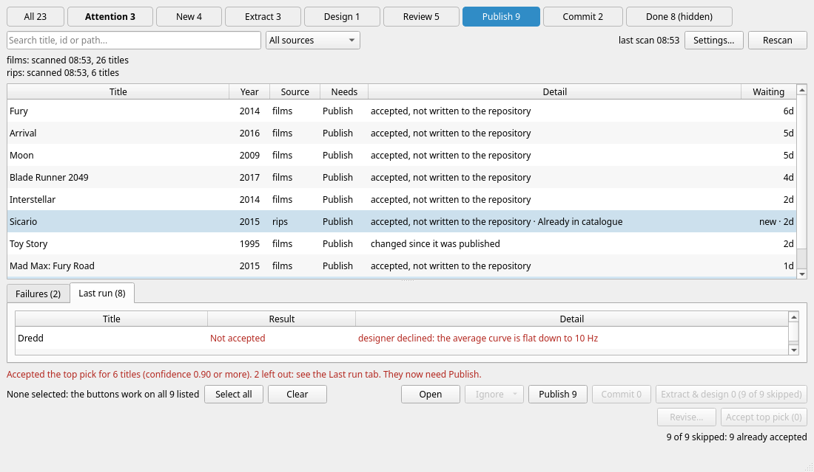

This page is about the machine work: extracting the audio of titles and getting a designer to propose filters for them. Publishing and committing are covered in [Publish and commit](publish.md), and the part that is yours, [review](review.md), comes in between.

### What the buttons work on

The buttons under the list work on **the titles you have selected**. If you have selected none, they work on **everything the list is showing**. The line at the bottom left says which:

* *3 selected of 23 listed*
* *None selected: the buttons work on all 23 listed*

Select rows with a click, `Ctrl`+click and `Shift`+click, or press *Select all* (which selects everything the current view lists) and *Clear*. To act on one kind of work, press its button on the strip and then *Select all*, or leave nothing selected. Search and the source drop-down narrow it further. Your selection survives a rescan and a run.

### Extract & design

*Extract & design* runs the machine work for the titles it is working on: it extracts the audio if that is needed and then asks the designer. **It never goes further than design.** A title that is waiting for review, or accepted, or published, is not touched, because a title is never taken past design without a person.

The label says what will happen. In the picture, nothing is selected in the *New* view, which lists four titles: *Extract & design 2 (2 of 4 skipped)* means 2 titles will be worked on and 2 are left out, and the line beneath the buttons says why, in words (*2 of 4 skipped: 2 waiting for review*). Over a whole library the reasons add up, for example:

> 19 of 23 skipped: 11 waiting for review, 3 already accepted, 2 already published, 2 failed before, 1 needs attention

| Skipped as | Because |
|---|---|
| waiting for review | designed already; it is your turn |
| already accepted | needs *Publish*, not design |
| already published | needs *Commit* |
| failed before | its extraction or design failed and nothing has changed; use [Retry failed](#failures-and-retry-failed) |
| needs attention | something other than a failed run: for example the [projects disagree](review.md#projects), or the source file changed |
| already done | there is nothing left to do |

So you can select a mixed set of titles and press the button: it does the eligible ones and tells you what it left out.

There is no *extract only* button, and you do not choose stages: *Extract & design* extracts first if the title has not been, and then designs.

**Confirmation.** If you have selected nothing and the button would work on more than one title, you are asked first (*Extract and design 120 titles?*, with *Cancel* as the default button), so a click on an unselected 1,200 title view is not a surprise. If you selected the titles yourself, there is no question.

**ffmpeg.** If any title needs extracting, BEQDesigner checks that ffmpeg and ffprobe can be found, and tells you how to set them up in [Preferences > Binaries](../ui/preferences.md#binaries) if not.

### While it runs

Each title row has two run controls. **Run progress** shows its current stage, with a percentage while ffmpeg reports extraction progress; stages such as design show the stage name. A title waiting for a stage slot says *Queued*. **Details** opens that title's event history. It is available while the title runs and after it finishes, until a later run replaces that title's history.

The details window updates while it is open. It includes timestamps, stage changes, external commands as shell-quoted arguments, output and errors, and exit codes where available. Use **Copy all** to share the text. The event history is held in memory and bounded; if older output is trimmed, the dialog says how many events were removed. Known credential forms are redacted before display.

The run status area shows aggregate queued, active, succeeded, failed and cancelled counts, alongside the overall run progress and the title and stage currently reporting progress.

Extraction and design have separate concurrency limits. They are each set to one by default, and can be raised independently to four in **Settings... > Locations > Concurrent extractions / Concurrent designs**. This lets one title move into design while another is still extracting, without exceeding either limit. Each title still extracts before it is designed. Publish and Commit remain serialized because they update shared catalogue files and repository state.

The work list keeps the existing separate **Extract & design**, **Publish**, **Commit**, and **Retry failed** buttons. Their counts and eligibility continue to follow the current selection, or the listed rows when none are selected.

* While a run is going, *Rescan*, the buttons and the [settings drawer](setup.md#the-settings-drawer) are disabled. You can still look around, open a title and review others. A title that the run is working on is read-only until it is done. Closing the window asks *A run is in progress. Cancel it and close?*.
* **Cancel** stops dispatching queued titles. Titles already dispatched finish their requested stages; a publish already in progress finishes its title, and a begun repository commit finishes. Completed work is kept, and queued titles are reported as cancelled rather than failed.

What a run produces for each title: the audio in the work directory, a `.beq` project with the designer's top pick (see [Projects](review.md#projects)), and a **review entry** in the review queue directory holding the candidates. Its metadata comes from the library (title and year) and, if there is a TMDB key, from [TMDB](https://www.themoviedb.org/). If the designer declines a title ("no rolloff detected", say), it still goes to review with no candidates, where you can skip or reject it.

When the run ends, the list is read again and the results are listed.

### Failures and Retry failed

If extraction or design fails for a title (the file was not found because of a wrong [path mapping](../ui/preferences.md#jriver), the designer was unreachable), the run carries on with the others and the failed title becomes **Attention**. A **Failures (N)** tab appears under the list with the title, source, stage and the reason.

A failed title is **not tried again** until its source file or the settings change. A transient problem, such as a NAS being offline or the designer being down, therefore stays failed until you say so. Once you have fixed it, press **Retry N failed**, which runs the titles in the panel again even though nothing changed. Select rows in the panel first and the button reads *Retry N selected*.

Note that the panel lists every failed title in the library, not just those in the current view, so retrying all of them asks for confirmation (*Retry N failed titles?*).

### The Last run tab

After a run, a **Last run (N)** tab shows what happened to each title, one line each, problems first: *Designed*, *Already designed*, *Failed* (with the reason), *Not retried*, *Published*, *Refused*, *Committed*, *Pushed*, *Not run* and *Skipped*. A commit adds a line per repository. Select a line to see all of its detail underneath, and hover for the full text. The summary is also in the line above the buttons: *Extract & design finished: 38 designed, 2 failed, 4 skipped*.

The tab is also where [bulk accept](review.md#bulk-accept) and [revising](revise.md) report what they did. It is replaced by the next thing you do.

If a run itself fails (not a title), the window says so in red and points at `Help > Logs`. Titles that finished before that are kept.

### Other buttons

| Button | What it does |
|---|---|
| **Open** | opens the [title page](review.md) for the selected title (or the first one listed). Double click a row, or press `Enter`, does the same |
| **Ignore** | a menu: *Ignore titles like this...* and *Ignore this title...*. See [Ignore](setup.md#ignore) |
| **Publish N** and **Commit N** | see [Publish and commit](publish.md) |
| **Revise...** | see [Revise](revise.md). It works only on the rows you selected |
| **Accept top pick (N)** | see [bulk accept](review.md#bulk-accept) |

All of these are disabled while a scan or a run is going, and while the setup is incomplete.
