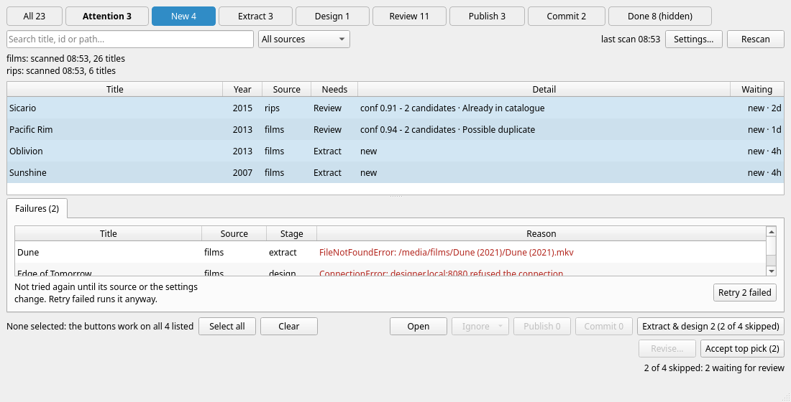

This page is about the machine work: extracting the audio of titles and getting a designer to propose filters for them. Publishing and committing are covered in [Publish and commit](publish.md), and the part that is yours, [review](review.md), comes in between.

### What the buttons work on

The buttons under the list work on **the titles you have selected**. If you have selected none, they work on **everything the list is showing**. The line at the bottom left says which:

* *3 selected of 23 listed*
* *None selected: the buttons work on all 23 listed*

Select rows with a click, `Ctrl`+click and `Shift`+click, or press *Select all* (which selects everything the current view lists) and *Clear*. To act on one kind of work, press its button on the strip and then *Select all*, or leave nothing selected. Search and the source drop-down narrow it further. Your selection survives a rescan and a run.

### Extract & design

*Extract & design* runs the machine work for the titles it is working on: it extracts the audio if that is needed and then asks the designer. **It never goes further than design.** A title that is waiting for review, or accepted, or published, is not touched, because a title is never taken past design without a person.

The label says what will happen. In the picture, nothing is selected in the *New* view, which lists four titles: *Extract & design 2 (2 of 4 skipped)* means 2 titles will be worked on and 2 are left out, and the line beneath the buttons says why, in words (*2 of 4 skipped: 2 waiting for review*). Over a whole library the reasons add up, for example:

> 19 of 23 skipped: 11 waiting for review, 3 already accepted, 2 already published, 2 failed before, 1 needs attention

| Skipped as | Because |
|---|---|
| waiting for review | designed already; it is your turn |
| already accepted | needs *Publish*, not design |
| already published | needs *Commit* |
| failed before | its design failed and nothing has changed; use [Retry failed](#failures-and-retry-failed) |
| needs attention | something other than a failed run: for example the [projects disagree](review.md#projects), or the source file changed |
| already done | there is nothing left to do |

So you can select a mixed set of titles and press the button: it does the eligible ones and tells you what it left out.

There is no *extract only* button, and you do not choose stages: *Extract & design* extracts first if the title has not been, and then designs.

**Confirmation.** If you have selected nothing and the button would work on more than one title, you are asked first (*Extract and design 120 titles?*, with *Cancel* as the default button), so a click on an unselected 1,200 title view is not a surprise. If you selected the titles yourself, there is no question.

**ffmpeg.** If any title needs extracting, BEQDesigner checks that ffmpeg and ffprobe can be found, and tells you how to set them up in [Preferences > Binaries](../ui/preferences.md#binaries) if not.

### While it runs

Each title row has two run controls. **Run progress** shows its current stage, with a percentage while ffmpeg reports extraction progress; stages such as design show the stage name. A title waiting for a stage slot says *Queued*. **Details** opens that title's event history. It is available when the first event is retained and stays available while the title runs and after it finishes. Starting any later run expires the previous run's histories, including histories for titles that are not selected in that run.

The details window updates while it is open. It includes timestamps, stage changes, external commands as shell-quoted arguments, output and errors, and exit codes where available. Use **Copy all** to share the text. The event history is held in memory and bounded; if older output is trimmed, the dialog says how many events were removed. Known credential forms are redacted before display.

The run status area shows aggregate queued, active, succeeded, failed and cancelled counts, alongside the overall run progress and the title and stage currently reporting progress.

Extraction and design have separate concurrency limits. They are each set to one by default, and can be raised independently to four in **Settings... > Locations > Concurrent extractions / Concurrent designs**. This lets one title move into design while another is still extracting, without exceeding either limit. Each title still extracts before it is designed. Publish and Commit remain serialized because they update shared catalogue files and repository state.

The shared progress bar counts terminal title outcomes out of the titles planned for the run. A title counts once when it succeeds, fails or is cancelled before dispatch; starting another stage does not advance the count. The status line names the latest activity and the count label summarizes queued, active, succeeded, failed and cancelled titles. ffmpeg percentages appear only in their title rows.

The work list keeps the existing separate **Extract & design**, **Publish**, **Commit**, and **Retry failed** buttons. Their counts and eligibility continue to follow the current selection, or the listed rows when none are selected.

* While a run is going you do not have to wait for it. **Extract & design** (it reads *Add N to the run*) and **Retry failed** add their titles to the run in progress, behind the titles it already has, and the *Working* chip lists everything it has queued or in hand. **Publish** and **Commit** (they read *... after the run*) wait, and start by themselves when the run ends, in the order you asked; so does extraction you ask for after the run has moved on to publishing. *Rescan*, *Accept top pick*, *Revise...* and the [settings drawer](setup.md#the-settings-drawer) are disabled until it ends. You can still look around, open a title and review others. A title that the run is working on is read-only until it is done. Closing the window asks *A run is in progress. Cancel it and close?*.
* **Cancel** prevents further extraction dispatch. Every title dispatched before Cancel takes effect finishes its requested stages, including design if it is waiting for a design slot. A publish entry already in progress finishes, and a begun repository commit finishes. This applies if you cancel before dispatch (no title starts), during extraction (dispatched titles finish), or while an extracted title waits for a design slot (that dispatched title still finishes). Work already handed to an extraction slot may finish too. Completed work is kept, and undispatched titles are reported as cancelled rather than failed. Anything waiting for the run to end is dropped too.

What a run produces for each title: the audio in the work directory, a `.beq` project with the designer's top pick (see [Projects](review.md#projects)), and a **review entry** in the review queue directory holding the candidates. Its metadata comes from the library (title and year) and, if there is a TMDB key, from [TMDB](https://www.themoviedb.org/). If the designer declines a title ("no rolloff detected", say), it still goes to review, with one flat candidate you can accept as *does not require BEQ*, or skip or reject.

When the run ends, the list is read again and the results are listed.

### Failures and Retry failed

If extraction or design fails for a title (for example a wrong [path mapping](../ui/preferences.md#jriver) or an unreachable designer), the run carries on with the others. The failure stays in the title’s indexed detail. Failed extraction remains **Extract**; failed design becomes **Attention**. The Attention chip also lists other problems, so use the title’s detail to see what failed.

Select failed titles and press **Retry N failed extraction**, **Retry N failed design**, or **Retry N failed extraction/design** for a mixed selection. With no selection, Retry acts on failed titles in the current filtered list and asks for confirmation. It retries even when neither the source nor settings changed. A normal interactive extraction can retry a failed extraction; unattended runs leave remembered failures alone until the source/settings change or retry is explicitly requested.

Use **Open** to inspect a failed title. Its **Failures** tab shows the full persisted, multiline reason in a read-only text box. Select text to copy it or press **Copy failure**. The title page’s Retry button names the failed stage. If no design exists yet, there is nothing to revise.

During a retry, the table’s Detail cell shows the current attempt, while its tooltip and the title page’s Failures tab retain the **Previous indexed failure**. The page shows the current attempt separately. That prior failure remains until the run’s refreshed index result is read: success clears it, another failure replaces it, and cancellation retains whatever failure the index still records.

### Run Details and results

The table’s **Run details** cell and the title page’s **Run Details** button open the same per-title dialog. Indexed failure text is shown separately from current run events. Events include redacted ffmpeg commands, output and exit codes; cache reuse explicitly says **cache hit** and **no command ran**. Use **Copy all** or select individual lines. A persisted failure can be inspected even when no run events remain.

Run event history is saved for reopening the window. Starting a new run expires the previous run’s history across all titles, including titles outside the new selection; their indexed failures remain available. Failure text and copied commands mask credentials.

The current run’s progress and outcomes are shown on each title’s row. When it ends, the list reads the refreshed index and the summary states the outcome, for example *Extract & design finished: 38 designed, 2 failed, 4 skipped*. Repository-wide failures are shown in full in the status-line tooltip. Bulk acceptance and revision also report on that status line.

If a run itself fails, the window says so in red and points at `Help > Logs`. Titles finished before that failure are kept.

### Other buttons

| Button | What it does |
|---|---|
| **Open** | opens the [title page](review.md) for the selected title (or the first one listed). Double click a row, or press `Enter`, does the same |
| **Ignore** | a menu: *Ignore titles like this...* and *Ignore this title...*. See [Ignore](setup.md#ignore) |
| **Publish N** and **Commit N** | see [Publish and commit](publish.md) |
| **Revise...** | see [Revise](revise.md). It works only on the rows you selected |
| **Accept top pick (N)** | see [bulk accept](review.md#bulk-accept) |

All of these are disabled while a scan or a run is going, and while the setup is incomplete.
