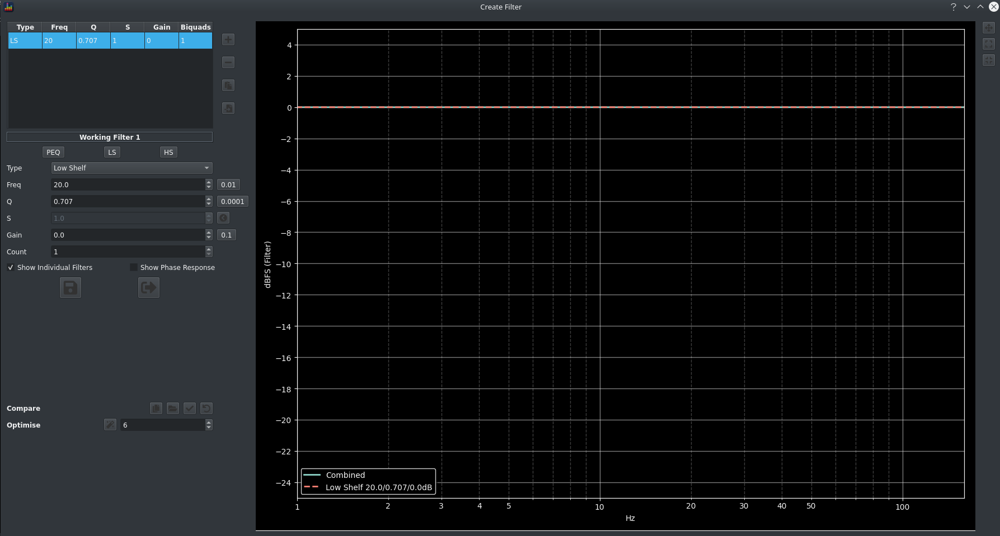
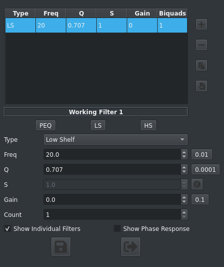
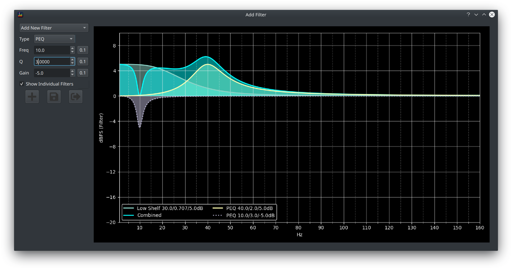

The Add/Edit Filter dialog allows you to create new or edit existing filters.  

It contains a series of fields for data entry and another graph pane which will show a preview of the filter response.

### Data Entry 

Lets take a closer look at the form fields:

From top to bottom:

* a dropdown to choose a filter to edit or to add a new one
* Type: the filter type to create/edit, the remaining fields will be displayed based on which values are required by the selected filter type
* Freq: the centre frequency for the filter type
* Q or S: the Q, and/or S if applicable, of the filter
* Gain: the filter gain in dB
* Count: for Shelf filters only, a convenience mechanism for stacking multiple shelf filters

The buttons to the right of each field show the current step size for the field, click the field to change the resolution to allow fine tuning or coarse adjustments.

The buttons across the bottom are, from left to right:

* Add a new filter
* Save the current filter
* Close the dialog

!!! warning
    Remember to click Add or Edit as changes are not committed to the signal unless one of these buttons is clicked

### Frequency Response Preview

The chart pane shows the aggregate filter response along with the response of each individual filter if the *Show Individual Filters* box is checked.

     
