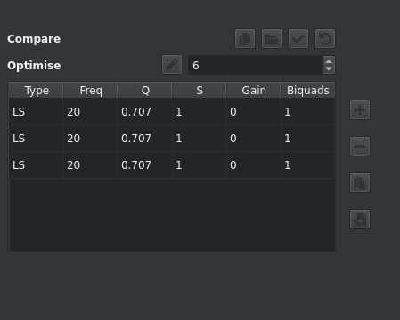

The Add/Edit Filter dialog allows you to create new or edit existing filters.  

It contains a series of fields for data entry and another graph pane which will show a preview of the filter response.

### Data Entry 

Lets take a closer look at the form fields:

From top to bottom:

* a table containing the list of created filters with buttons to allow
  * add a new filter
  * delete the selected filter
  * copy the selected filter
  * import a set of filters from Room EQ Wizard (exported in txt format)  
* Type: the filter type to create/edit, the remaining fields will be displayed based on which values are required by the selected filter type
* Freq: the centre frequency for the filter type
* Q or S: the Q, and/or S if applicable, of the filter
* Gain: the filter gain in dB
* Count: for Shelf filters only, a convenience mechanism for stacking multiple shelf filters

!!! info
    Use the button next to each field to change the size of the step up or down
    
    Click multiple times to see the available step sizes

The buttons to the right of each field show the current step size for the field, click the field to change the resolution to allow fine tuning or coarse adjustments.

The buttons across the bottom are:

* Save the current filter
* Close the dialog

!!! warning
    Remember to click Add or Edit as changes are not committed to the signal unless one of these buttons is clicked

### Comparing Filters

Clicking the 1st button takes a snapshot of the current set of filters to allow for comparisons of 2 filter sets. 
The subsequent buttons allow for:

* load a filter (either a BEQ filter or a saved BEQ filter)
* apply the snapshot to the main filter
* discard the snapshot
* attempt to optimise the filters to reduce to fit in the specified biquads

### Frequency Response Preview

The chart pane shows the aggregate filter response along with the response of each individual filter if the *Show Individual Filters* box is checked. Phase response can also be displayed by checking the *Show Phase Response* checkbox. 

     

Buttons to the right of the chart allow for controlling chart limits.
