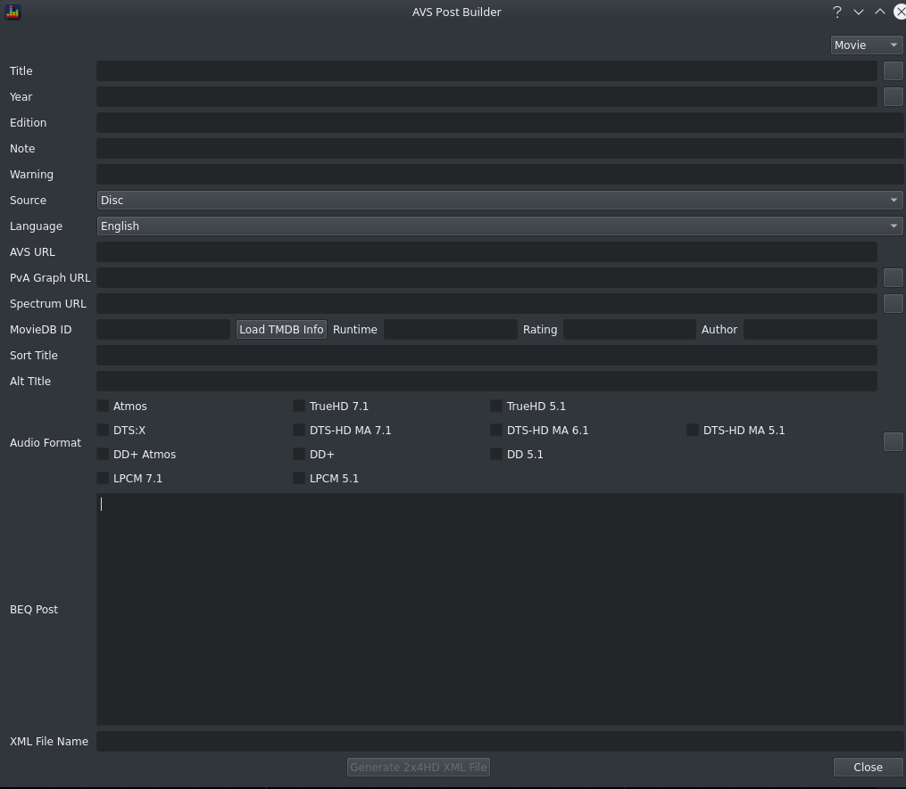

BEQ filter publishers can use `Tools > Create AVS Post and XML` to:

* add metadata to the minidsp xml that enable the [BEQCatalogue](https://beqcatalogue.readthedocs.io/en/latest/) to publish a database of content
* generate text in a standard format to post the new update to avsforum  

