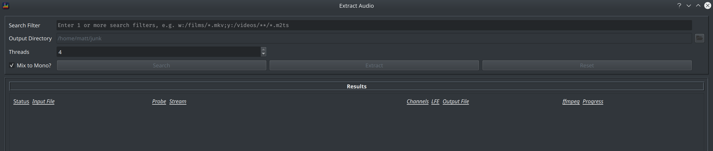
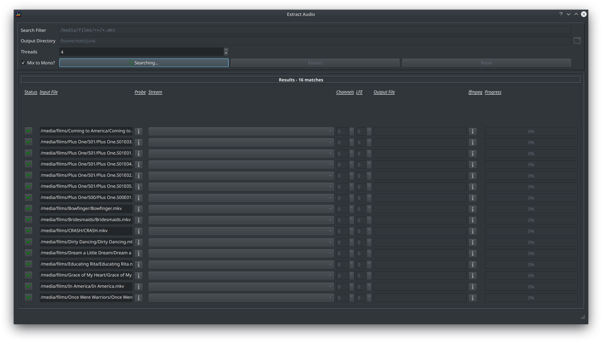
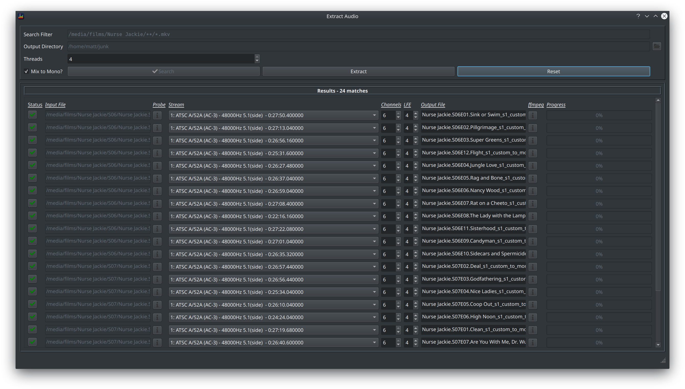

The Batch Extract dialog allows you to search entire paths and/or folders for files from which you wish to extract audio. This can be left running in the background until it completes and hence is a much less labour intensive way to extract audio from many files.

Hit `CTRL+SHIFT+E` or select `Tools > Batch Extract` to launch the dialog.

### Searching for Files

Search filter(s) are entered via the *Search Filter* field, wildcards are supported where * matches any character and ** allows for a search through an entire folder tree to any depth.

Enter 1 or more filters then click *Search*.

The *Search* button will change to display *Searching...* and the list should gradually fill up with matching files. The total number of matches will be displayed in the title bar.

### Controlling the Conversion

Once all matching files have been found, BEQDesigner collects metadata about each file using `ffprobe` and selects what it thinks is the preferred audio track. 

Click the button in the status field to prevent further processing of the specified file, the tick will turn to a cross in this case.

A subset of the options from [Extract Audio](./extract_audio.md) are available, these are:

* Mix to Mono: whether to downmmix all channels to mono or not
* Stream: select the audio track to extract
* Channel Count/LFE Channel: only relevant if *Mix to Mono* is checked, controls the gain adjustments applied during that mix down 
* Output File: the filename to write to

### Extracting

Click the *Extract* button to trigger processing of all files. The no of files to process in parallel is controlled by the *Threads* value and defaults to the number of cores available on the host machine.

Progress is reported via the *Progress* column.
