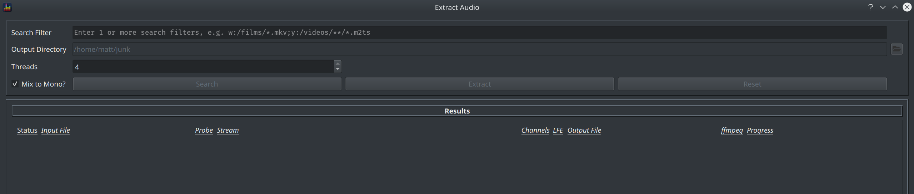
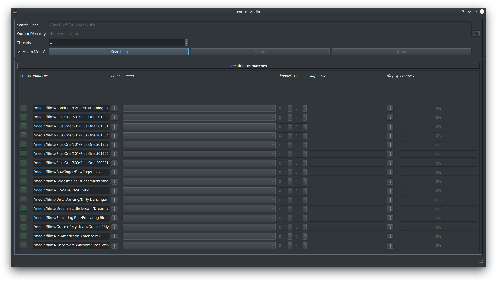
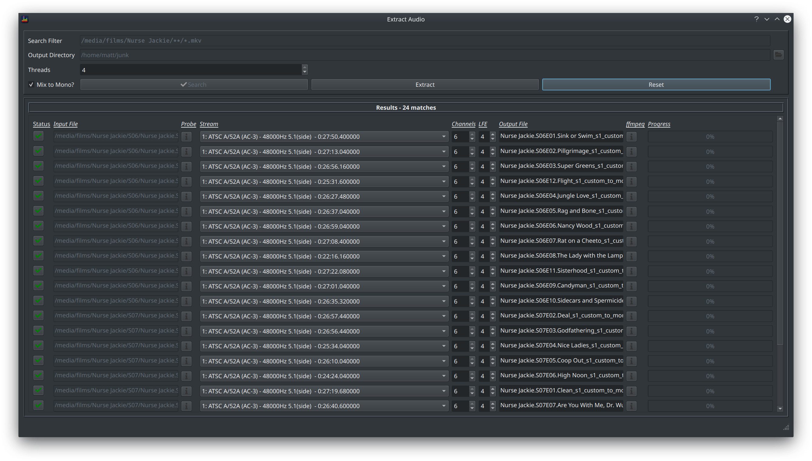
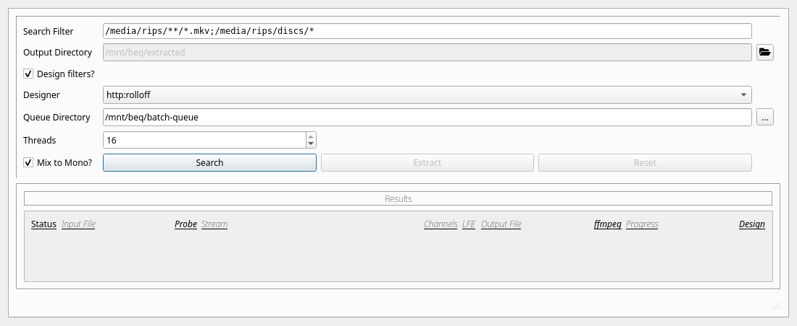

The Batch Extract dialog allows you to search entire paths and/or folders for files from which you wish to extract audio. This can be left running in the background until it completes and hence is a much less labour intensive way to extract audio from many files.

Hit `CTRL+SHIFT+E` or select `Tools > Batch Extract` to launch the dialog.

### Searching for Files

Search filter(s) are entered via the *Search Filter* field, wildcards are supported where * matches any character and ** allows for a search through an entire folder tree to any depth. Separate several filters with a semicolon, for example `w:/films/*.mkv;y:/videos/**/*.m2ts;d:/bd_rips/*`. A filter that is a folder on its own means everything directly in it.

Enter 1 or more filters then click *Search*.

The *Search* button will change to display *Searching...* and the list should gradually fill up with matching files. The total number of matches will be displayed in the title bar.

#### Blu-ray and DVD rips

A folder that is a Blu-ray disc rip (it contains `BDMV/index.bdmv`) or a DVD rip (it contains `VIDEO_TS/VIDEO_TS.IFO`, and a match on the `VIDEO_TS` folder itself is also taken as the disc) is added as **one** file, however many files it holds. Other folders are ignored. Its main feature is chosen for you, because a batch run has nobody to ask: the longest playlist for a Blu-ray and the longest title for a DVD. The input is shown as the title's name followed by the disc folder in square brackets.

* You cannot pick another title here. A DVD that holds several episodes often has "play all" as its longest title, so look at what was chosen. For a single Blu-ray you can choose any playlist with the disc button in [Extract Audio](./extract_audio.md).
* Reading a DVD needs an ffmpeg that was built with the `dvdvideo` demuxer. If yours was not, the extraction fails with a message that says so. Encrypted (CSS) discs cannot be read, rips are normally already decrypted.

### Controlling the Conversion

Once all matching files have been found, BEQDesigner collects metadata about each file using `ffprobe` and selects what it thinks is the preferred audio track. 

Click the button in the status field to prevent further processing of the specified file, the tick will turn to a cross in this case.

A subset of the options from [Extract Audio](./extract_audio.md) are available, these are:

* Mix to Mono: whether to downmmix all channels to mono or not
* Stream: select the audio track to extract
* Channel Count/LFE Channel: only relevant if *Mix to Mono* is checked, controls the gain adjustments applied during that mix down 
* Output File: the filename to write to

### Extracting

Click the *Extract* button to trigger processing of all files. The no of files to process in parallel is controlled by the *Threads* value and defaults to the number of cores available on the host machine.

Progress is reported via the *Progress* column.

### Designing Filters

Batch Extract can also ask a designer to propose filters for each file as it is extracted, which is why the dialog is called *Batch Extract & Design*. The controls appear once at least one designer has been added in [Preferences > Designers](./preferences.md#designers).

* Design filters?: tick it to design as well as extract.
* Designer: the designer to ask, the default is set in Preferences.
* Queue Directory: where the results are written, the default is set in Preferences. It must be set, otherwise you are told to select one.

The *Design* column shows how each file got on: a tick (hover to see the confidence), a ban sign if the designer declined it (with the reason), or a warning if it failed (with the message). Click it for the detail.

Notes:

* Design writes one *review entry* per file, named after the file (or the disc folder) without its extension, so the names have to be unique. If two files would share a name you are told to rename one or remove the duplicate before extraction starts.
* The designer always works from a mono mix, whatever *Mix to Mono?* is set to. If you keep a multichannel file, a second mono extraction is made for the designer.
* **The entries have no metadata.** The designer knows the file's name and nothing else, so the title, year and audio type have to be filled in before an entry can be accepted.
* When every design is finished, the [Review Folder](../library/review.md#review-folder) window opens on the queue directory by itself. You can also open it later with `Tools > Review Folder...`.

For a whole library, rather than a search of a few folders, see the [Library Work List](../library/index.md).
