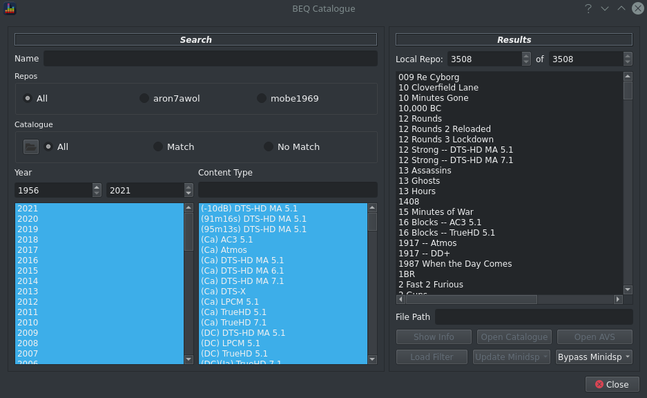

All filters created by avsforum posters contain additional metadata which provides content for online browsing via the [BEQCatalogue](https://beqcatalogue.readthedocs.io/en/latest/) and for easy filter management via the [ezbeq](https://ezbeq.readthedocs.io/) webapp.

BEQDesigner provides the ability to browse this data in a purely offline mode via `Tools > Browse Catalogue`.

Ensure the [minidsp-rs](https://github.com/mrene/minidsp-rs) is loaded into the relevant [preferences](./preferences#binaries) in order to allow BEQDesigner to send filters to a minidsp 2x4HD.
