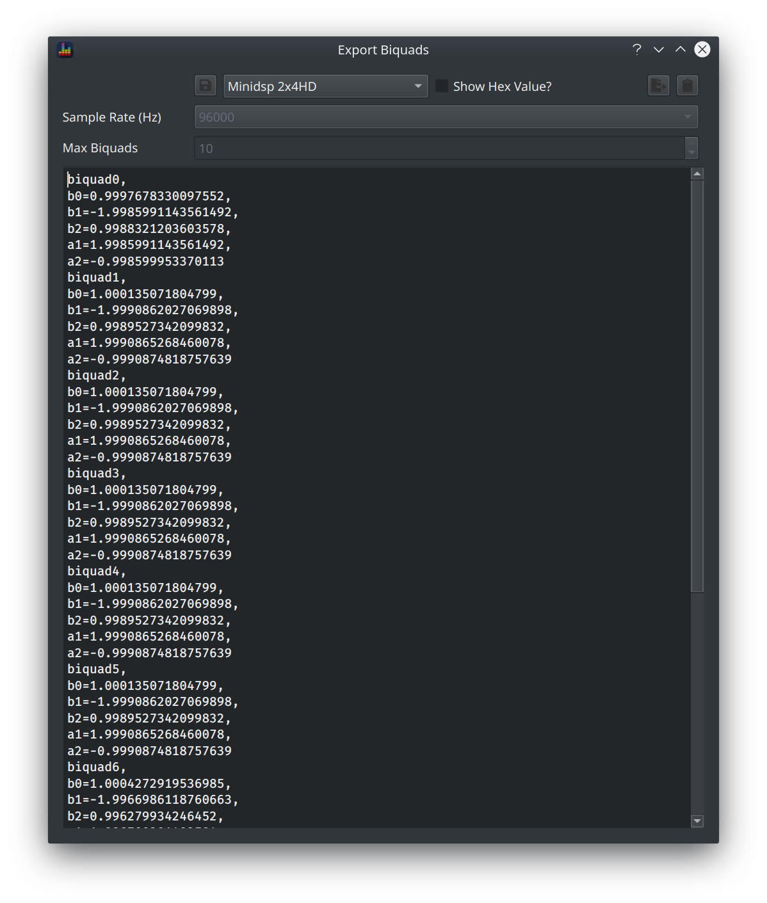

BEQDesigner provides the ability to export the current filter as a set of biquad coefficients in order to allow the filters to be recreated in an external DSP platform or some other application.

Select `Tools > Export Biquads` or hit `CTRL+B` to use this feature.

On selection, you will be presented with:

### Options

The dialog contains a text area which prints out the filters in biquad coefficient format.

A number of buttons across the top do the following, from left to right:

* save the currently selected options as the default
* Use MiniDSP style?: Select this option if you are exporting in order to import into the minidsp UI otherwise leave unchecked
* save to file: saves the displayed text to a file
* copy to clipboard: copies the displayed text to the system clipboard

Two further options are provided

* sample rate: biquad coefficients vary with sample rate so ensure you select the correct sample rate for your DSP platform
* max biquads: the filter is padded with pass through filters up to the given number, this is primarily for compatibility with the minidsp import function

!!! warning
    There is no error displayed if the filter contains more than the max exported number of biquads, it will simply not export the excess biquads
