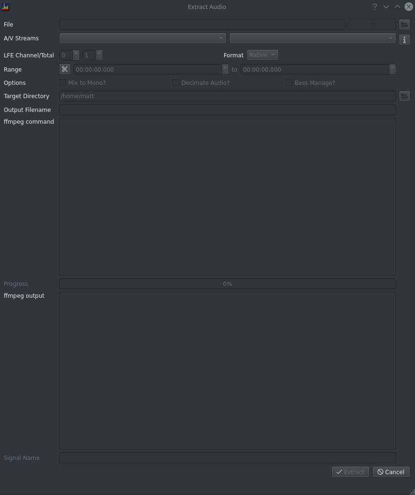
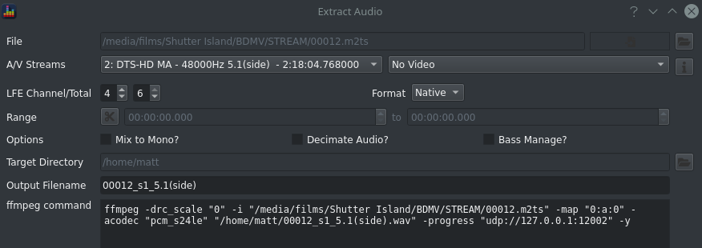
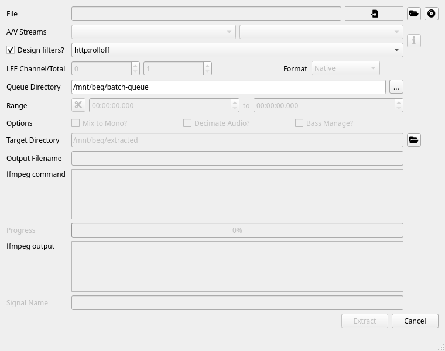
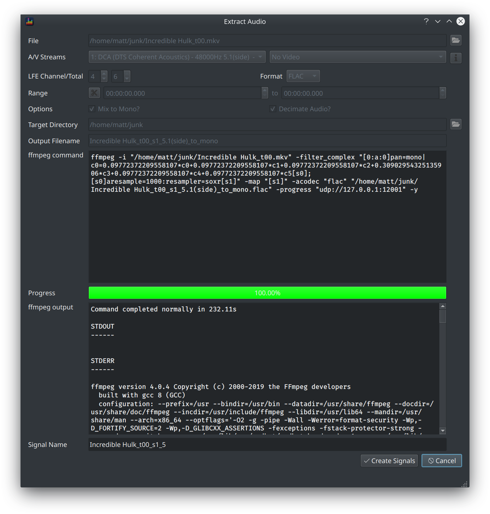

The Extract Audio dialog allows you to extract an audio track from supported file types into a format suitable for consumption by BEQDesigner.

Use `Tools > Extract Audio` or `CTRL+E` to open.

!!! info
    Use the [Batch Extract](./batch_extract.md) tool if you have a large number of files to process.

### What formats are supported?

Anything supported by ffmpeg, full details available via the [ffmpeg docs](https://ffmpeg.org/ffmpeg-formats.html). 

Commonly used formats (mkv, BD folder rips) are supported.

### Selecting the Content

To get started, click the button on the top row to select a file. To use a Blu-ray disc rip instead, click the disc button next to it and choose the folder that contains the `BDMV` folder, then pick which title (playlist) to extract.
BEQDesigner uses `ffprobe` to determine what content is present in the file and makes this information available on screen.

Use these controls to select exactly what to extract from the file:

* A/V Streams: 2 dropdowns showing the audio and video tracks, the i button at the end pops up another dialog with the raw information from ffprobe for further investigation
* LFE Channel/Total: the LFE channel index and total number of channels in the audio track, these values should generally left unchanged
* Format: choose between native (i.e. export to WAV) or FLAC, bear in mind that WAV files are limited to <4GB (so a full bandwidth multichannel audio track of the entire film should generally use flac to avoid breaching this limit)
* Range: click the scissors button to set a time range, when set this will limit the output audio file to the specified time period
* Mix to mono: applicable to multichannel audio files only, mixes the individual channels into a single mono file using per channel gain adjustments required to handle the LFE channel and to ensure the resulting signal does not clip during summation
* Decimate Audio: resample to the sample rate set via [Preferences](./preferences.md#extraction), checking this option is generally a sensible choice when designing BEQ filters
* Bass manage: application to multichannel audio files only, applies bass management to the individual channels to produce multichannel output
* Target Directory: where to export the file to, default location is set via [Preferences](./preferences.md#extraction)
* Output Filename

### Extracting

The ffmpeg command updates as the options change so you can see exactly what is about to happen. 

Click extract to execute that command, the progress bar will update as the extraction completes. This may take a long time depending on where the file resides, how big it is and where you are writing to. For example, if the file resides on a network share, is many GB in size and you are writing back to another network share then the file has to be 

* pulled over the network to the local machine
* processed
* written back over the network to the file server

Alternatively if the file is on a local SSD and you write back to that SSD, processing should be pretty quick.

### Designing Filters

If at least one designer has been added in [Preferences > Designers](./preferences.md#designers), the dialog also has a *Design filters?* checkbox, a drop-down to choose the designer and a *Queue Directory*. Tick it to have a designer propose filters for the file as soon as it has been extracted:

* Designer: which designer to ask, the default is set in Preferences.
* Queue Directory: the folder that the result is written to, the default is set in Preferences and a folder you choose here is remembered.

When the extraction finishes, BEQDesigner extracts a mono mix of the audio for the designer if the file you kept is not already mono, asks the designer, and writes one *review entry* to the queue directory, named after the output file. It then asks *Open it for review now?*. Answer yes to open the [Review Folder](../library/review.md#review-folder) window on that folder, where you can look at the candidates, complete the metadata (a designed file does not know its title, year or audio type yet, so these have to be filled in before it can be accepted), and accept it.

The checkbox is cleared each time you choose a file and is not available in [Remux Audio](./remux_audio.md), which applies a filter that has already been designed. For many files at once, use [Batch Extract](./batch_extract.md#designing-filters).

### Creating Signal(s)

When complete, the ffmpeg output field will be filled with the output from ffmpeg and the *Create Signals* button will become enabled. Click the button to load the extracted audio as signal(s).
