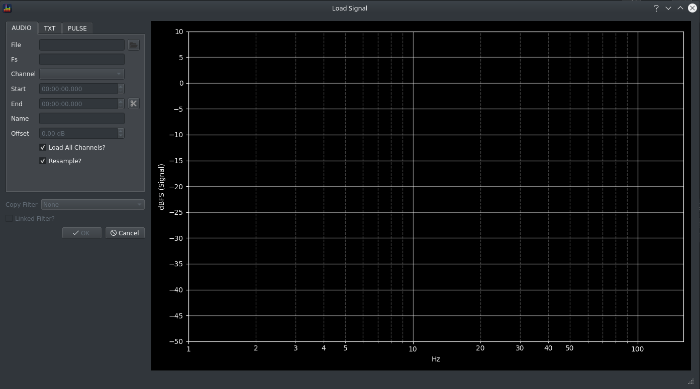
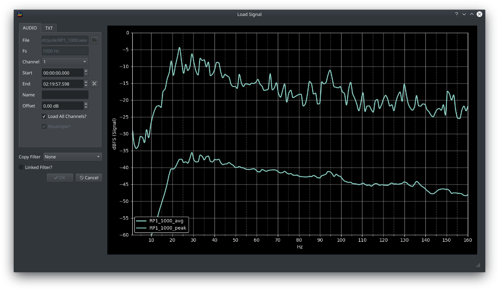
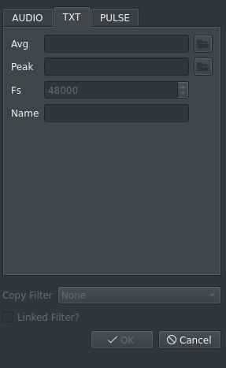

The Load Signal dialog allows you to load one or more signals from a selected audio file or from txt files using the common FRD format.

It contains a series of fields for data entry and another graph pane which will show a preview of the selected signal.

### Adding 1 or more Signals from an Audio File
 

  1. Click the button next to the file field and select an audio file (wav or flac are supported) via the resulting file dialog, multichannel audio files are supported. 
  2. If the file is loaded successfully, a preview of the response will be shown along with:
    * the sample rate of the track
    * (if multichannel), a channel selector dropdown 
    * the duration via the end time field

  3. You can now choose exactly how you want to create the signal using the remaining controls. The preview chart will update as each change is made. 
  4. Name the signal by typing text into the name field
  5. Click OK, the dialog will close and the signal(s) will now be available via the main screen.

#### Dealing with Multichannel Audio Files

If the selected audio file contains more than 1 channel, the channel dropdown will be enabled.

Changing the selected channel will update the preview chart to show the selected channel.

##### Loading One Signal

Uncheck the *Load All Channels?* checkbox to load a single channel.

##### Loading All Channels

Check the *Load All Channels?* checkbox to load all channels.

The resulting signals will be named according to the channel layout of the audio file as `<name>_<channel_suffix>`

For example, if you 

* load all channels from an 8 channel wav file
* enter RP1 in the name field

then 8 signals will be loaded named

* RP1_L
* RP1_C
* RP1_R
* RP1_LFE
* RP1_BL
* RP1_BR
* RP1_SL
* RP1_SR

This naming convention becomes useful when [Remuxing](../workflow/remux.md)

Loading all channels also enables the [Bass Management Simulation](../workflow/bass_management.md).

#### Loading a section of the track

It can be useful to zoom in on a particular demo scene, to do this find the timecodes for the scene via your usual playback software and then:

* enter the start time into the *Start* field 
* enter the end time into the *End* field
* click the scissors buttons

#### Changing the signal level

The signal level can be changed via the use of a *Gain* filter or by applying an offset when adding the signal. This is achieved using the offset field and it applies the specified gain adjustment to the signal when it is added.

The on disk file is not affected by use of this option.

#### Resampling 

If the selected audio track is an original audio file, it will be at some higher sample rate (typically 48kHz for movie content and 44.1kHz for audio). 

This resolution is largely unnecessary for BEQ filter design purposes so resampling to a lower sample rate (1kHz by default, see [Preferences](./preferences.md#analysis) for more detail) will make the application much more responsive during filter design.

Check the *Resample?* box to decimate the signal as it is added.    

!!! warning
    Full range signals can require a large amount of RAM to analyse. Use a machine with at least 12GB of RAM if you plan to analyse a 2 hour long 7.1 audio track at 48kHz. 
  
#### Applying Filters 

If other signals have already been loaded, two further options are available

* copy a filter from an existing signal to this signal using the *Copy Filter* dropdown 
* link this signal as a slave using the *Linked Filter* checkbox 

### Adding a signal from an FRD file

The FRD file format is commonly used in speaker design and room eq software. 2 files are required in order to provide data for the peak and average views.

  1. Click the TXT tab
  2. Click the button next to the avg field and select an FRD file containing the avg data
  3. Click the button next to the avg field and select an FRD file containing the peak data
  4. BEQDesigner will set the sample rate as 2x the max frequency in the FRD, leave this value as is
  5. BEQDesigner will set the signal name based on the FRD file name, edit this as necessary
  6. If signals have already been loaded then [filters can be applied](#applying-filters) if desired
  7. Click OK, the dialog will close and the signal(s) will now be available via the main screen.

!!! info
    The spectrum and waveform views are not available when using signals loaded from FRD files. 
