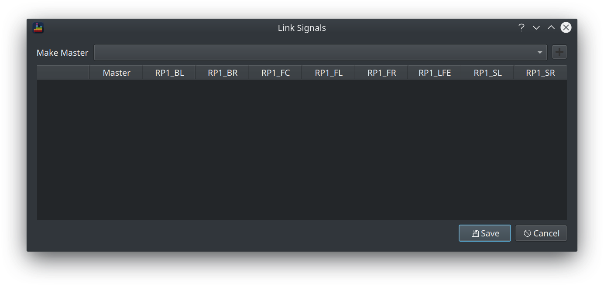

BEQDesigner presents the main window when it starts up.  

This window has two columns.

On the left is the main graph pane which is used to display the various signals and filters loaded into the application.
On the right are a pair of tables with associated controls which allow you to see and control which signals and filters are loaded into the application.

Refer to [Signals & Filters](../index.md#signals-and-filters) for an explanation of what a signal or a filter is.

### Signals

Take a closer look at the signal table.

#### The Signal Table

After signals have been added, the signal table shows a list of all those signals and shows:

* the signal name
* whether it is a [master or slave](../index.md#linking-signals) signal
* the sample rate of the signal in Hz
* how long the signal is 
* whether a volume offset (in dB) has been applied

#### Signal Controls

When no signals are loaded, there is just one enabled button:

* Add : clicking this button opens the [Load Signal](./load_signal.md) dialog which allows you to load one or more channels from an audio file into BEQDesigner
    
The remaining buttons are enabled after a signal has been loaded, these are:

* Link: [link signals](#linking-signals) in a master-slave relationship
* Delete: remove an individual signal
* Clear: remove all signals

#### Linking Signals

The link button opens the Link Signals dialog.

To link signals in a [master-slave relationship](../index.md#linking-signals):

  1. Select the master signal from the dropdown
  2. Click the + button
  3. Check the boxes for the signals you want to enslave
  4. Click OK
  
Here's an example showing a 7.1 track with the LCR and the surrounds linked into 2 groups.

After clicking OK, the signal table updates to show the relationship between the signals

### Filters

Take a closer look at the filter table.

The currently selected signal is displayed in the title bar which means this table shows the filter for whichever signal has been selected in the signal table.

However note that filters can still be added when no signals are loaded.

#### The Filter Table

The filter table contains a list of the filters added and will show the following information as appropriate:

* the filter type (e.g. low shelf, PEQ)
* the frequency (in Hz) of the filter
* the Q and S of the filter 
* the filter gain (in dB)
* the number of biquads required to implement the filter

The precise data shown will vary with the type of filter, for example:

* S is only defined for a shelf filter
* gain is not applicable to a low or high pass filter 

#### Filter Controls

When no filters have been added, there are 4 separate buttons enabled. These are:

* P1, P2 and P3: clicking any one of these buttons will load the specified filter preset. See [Filter Presets](./presets.md) for instructions on how to define such presets.
* Add : opens the [Add Filter](./add_filter.md) dialog 

When 1 or more filters have been added, the remaining buttons become relevant.

The following buttons are enabled if a single filter is selected in the table: 

* Edit : opens the [Edit Filter](./add_filter.md) dialog to allow the filter to be edited
* Delete : deletes the selected filter

Finally the Clear button removes all filters from the signal.

### Main Graph

Lets take a look at the main window when a filter is loaded

This shows the spectral content of the signal. 

The y axis range is automatically set to display a 60dB range while ensuring the peaks of the signal are visible.

#### Main Graph Controls

The precise content shown depends on the selections made via the controls in the bottom right corner

The options available are:

* Peak/Avg : show the peak response, the avg response or both
* With Filters? : show the response of the signal with or without the filters applied or show. When both are shown, the unfiltered response switches to a dashed line.
* Filter Response? : show the final filter response, the individual filters or no filters at all. Note that the filter magnitude is plotted on the secondary y axis (on the right) 
* Show Legend? : shows a legend explaining which line is which
* +3dB/octave? : applies a crude 3dB/octave adjustment which approximates the difference between white noise showing as flat or pink noise showing as flat  

Further options to render the responses differently or interact with the content are available above the main graph. 

#### Showing the difference between Curves

Two combo boxes are shown next to the *Reference* label

The first combo box lists the displayed signals while the second lists the filters.

Selecting either option will cause the selected curve to be shown as a straight line at 0dB, all other curves are then displayed as the difference to that *reference curve*. 

#### Response Smoothing

All curves can be smoothed and various smoothing methods are available, these are

* fractional octave smoothing from 1/1 to 1/24
* Savitzky-Golay : applies a [Savitsky-Golay filter](https://docs.scipy.org/doc/scipy-1.2.1/reference/generated/scipy.signal.savgol_filter.html) to the signal

Fractional octave smoothing will change the energy levels significantly and are primarily useful for assessing perceptual balance of a full range signal.
Savitsky-Golay smoothing is more useful for cutting through the noise (spikiness) in a full range signal without changing the reported energy level.

Smoothing will be applied to the currently selected signal if the *All Signals* checkbox is unchecked otherwise all loaded signals will be smoothed.

!!! warning
    Subwoofer range signals do not generally require any smoothing so it is recommended to only apply smoothing to full range signals. 
    
#### Magnitude by Frequency

Clicking the eye button opens the Values dialog

This allows you to enter a frequency and see the magnitude at that frequency for each displayed curve.

#### Controlling Graph Limits

Clicking the right hand button opens the Graph Limits dialog

This allows control over:

* the x axis range
* the primary (signal) y axis range
* the secondary (filter) y axis range
* whether to use a linear or log frequency scale

Shortcuts to the commonly used subwoofer and full range default ranges are provided.
