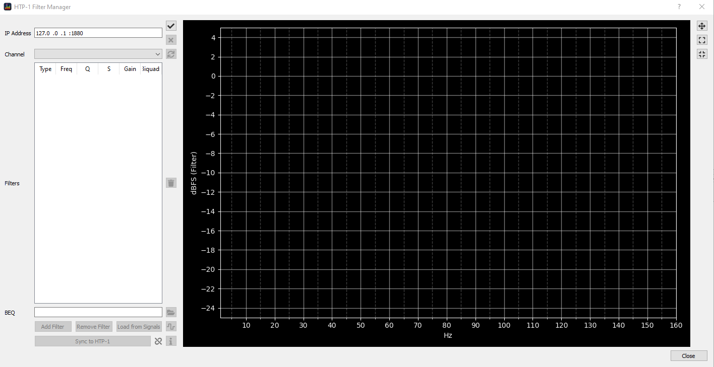

The [Monoprice HTP-1](https://www.monoprice.com/product?p_id=37887) is a 16 channel AV Processor. It has two particular features that make it relevant to BEQDesigner
  
  1. a 16 band parametric equaliser per channel
  2. a websocket based API that allows an application to configure that equaliser
  
The processor provides a web based UI for manual configuration of the parametric equaliser however this UI has some limitations

  1. there is no way to bulk load a set of filters in one go
  2. the UI lists filters per band rather than per channel
  3. there is no visualisation of the resulting filters
  
BEQDesigner has all of these features and the HTP-1 Filter Manager dialog enables a user to define filters in BEQDesigner and then sync them with the device.

### Opening the Dialog

This is launched via `Tools > Manage HTP-1 Filters` or via keyboard shortcut `CTRL+M`.  

### Connecting to the Device

The IP address of the processor is visible on the front panel of the device in either the bottom left or bottom right corner (depending on how it is connected to the network)

  1. Enter this address into the IP Address field followed by `:80`, for example if the IP address is `192.168.1.123` then enter `192.168.1.123:80`
  2. Click the `Connect` button, this is labelled with a tick (a.k.a check)

Upon a successful connection, the current state of the device will be loaded. The dialog will now show:

  1. the active channel groups as configured via `System Configuration > Speakers` in the HTP-1 UI
  2. the PEQs specified in each band via `System Configuration > EQ`

The dialog is now in [single channel beq mode](#single-channel-beq-mode). 

### Basic Controls

A number of fields and buttons are now enabled, from top to bottom:

  1. Disconnect: disconnects from the HTP-1
  2. Resync: reloads filters from the HTP-1, any local updates are discarded
  3. Channel: select the current channel to edit, the displayed filters will update on change
  4. Filters: shows the filters currently loaded into the 16 band PEQ for the selected channel
  5. Delete: any selected row is reset to a passthrough filter (i.e. gain = 0dB), multiple channels can be selected at once
  6. Sync to HTP-1: updates the current channel with the displayed filters

### Updating Filters in the HTP-1

Pressing the `Sync to HTP-1` button updates the device with the configured filters. 

On a successful update, the icon next to the button will turn into a green tick.
If the update was unsuccessful for any reason, the icon will turn into a red x.

!!! info
    After any sync, the `info` button will be enabled which will show a dialog showing all individual updates. Refer to this in the event of problems.
    

### Single Channel BEQ Mode

This mode allows an existing BEQ filter to be added to the currently selected channel. 

This relies on the presence of the BEQ filters shared in minidsp xml format, download these using [the Preferences dialog](preferences.md#BEQ-Files)   

!!! warning
    This feature is of no practical use until the HTP-1 supports shelf filters. A warning will be displayed if you do try to sync until that time
      
    
#### Adding a BEQ

  1. Click the `Open` button and select an xml file
  2. Click `Add Filter`, the filter will be added into the last n PEQ bands and the chart will show a preview of the total filter
  
  

  3. [Sync](#updating-filters-in-the-htp-1) the filters to the device
 
#### Removing a BEQ

This assumes you have added the BEQ using this dialog, i.e. that the specified filters are in the last n PEQ bands.

  1. Click the `Open` button and select an xml file
  2. Click `Remove Filter`, the matching filters will be highlighted
  
  

  3. Click `Delete` to replace them with a passthrough
  4. [Sync](#updating-filters-in-the-htp-1) the filters to the device

### Signal Mode

Click the highlighted button to switch into signal mode.

This does the following:

  1. creates a signal in BEQDesigner for each active channel named `pulse_<channel name>` (e.g. `pulse_lf` is the left front channel)
  2. for each channel, loads the 16 band PEQ into the filter for that channel
  3. maps each signal to the corresponding channel and displays this mapping in the `Signal Mapping` field
  4. Changes the channel dropdown to a preview, it now previews the filter for the currently selected channel

You can now close the dialog and continue editing in BEQDesigner as normal, this enables access to features like

  1. [Sharing filters across signals](ui/main_window.md#linking-signals)
  2. [Simulating Bass Management](workflow/bass_management.md)
  3. [Loading and Saving Filter Configurations](ui/load_save.md)
  
#### Updating Filters in Signal Mode

Filter operations (add/remove BEQ, sync to HTP-1) in signal mode operate on all selected channels in the `Signal Mapping` box.

This allows you to update **all** channels with one click or add a BEQ filter to multiple subwoofer channels at once. 

### Designing your own BEQ 

An alternative to downloading all channels from the device is as follows

  1. Follow the usual [beq workflow](workflow/beq.md) 
  2. Connect to the HTP-1
  3. Double click a sub channel in the signal mapping dialog
  4. Select all sub channels and the named signal, click `Save`
  
  5. Preview the channel to verify
  6. [Sync](#updating-filters-in-the-htp-1) the filters to the device

!!! warning
    This feature has a flaw in the current beta, watch [the defect](https://github.com/3ll3d00d/beqdesigner/issues/349) for a fix
