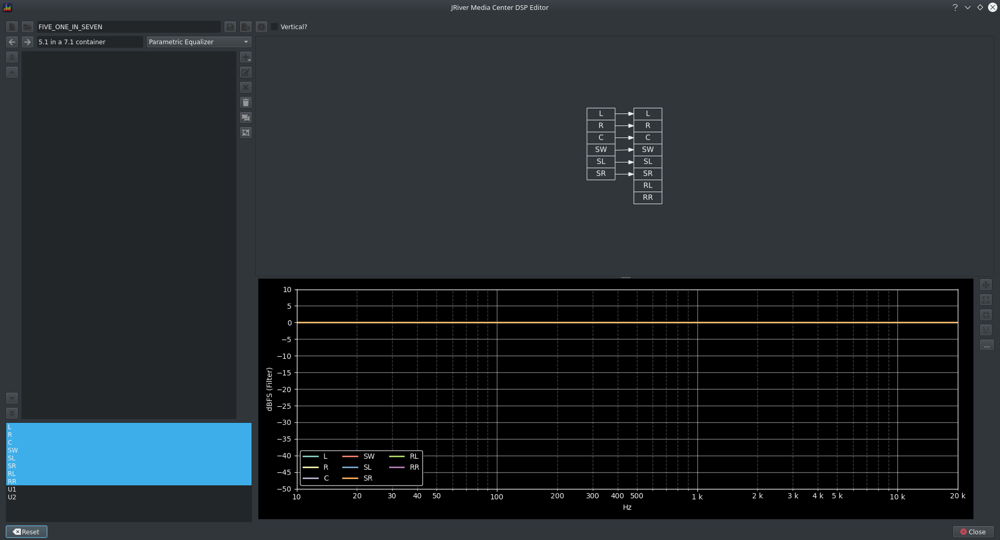
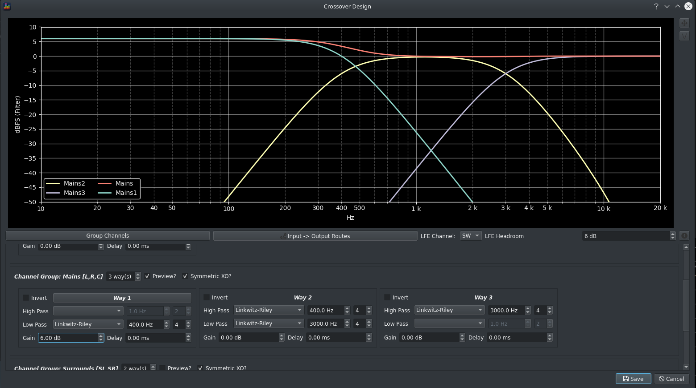
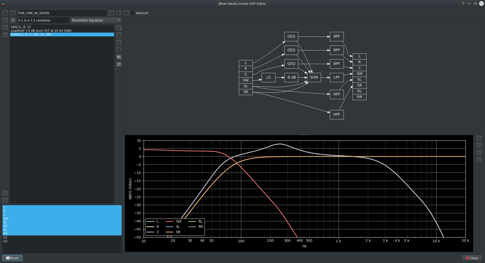

[JRiver Media Center](https://jriver.com/) is a media player which integrates a rich DSP engine with video playback. The DSP engine provides a feature set which exceeds that of all AV processors with the exception of immersive audio support.

The Media Center application uses its [DSP Studio](https://wiki.jriver.com/index.php/DSP) to configure the DSP engine however this has some limitations:

* it uses an unconventional definition of Q for both shelf filters and high/low pass filters
* there are limited high/low pass filter types available  
* there are limited bass management options available and crossover design is tricky  
* it has no fast/easy way to manage large filter sets or any interoperability with filter design tools
* the filter pipeline is presented as a simple text list which can make a signal chain difficult to understand
* there is no visual guide to the filter response  
* usability is a challenge as a result of an absence of keyboard shortcuts and undo/redo functionality

BEQDesigner attempts to solve these problems.

### Opening the Dialog

This is launched via `Tools > Manage JRiver MC Filters` or the `CTRL+J` keyboard shortcut.

### Getting Started

!!! info
    Use the button tooltips to understand what they do.

To create a new (empty) configuration:

* click New
* select an output format
* enter a configuration name

To load an existing configuration:

* click Open
* select a dsp file

The screen will update to display the contents of the _Parametric Equalizer_ configuration

A number of features should be noticeable

* a visualisation of the filter pipeline 
* a simulation of the frequency response by channel

### Adding Filters

Click the add button to see the supported filter types

#### GEQ

After selecting the channel(s) to apply the filter to, the GEQ filter design screen opens

When creating a new filter, this screen replicates the behaviour of the JRiver _Equalizer_ screen with respect to centre frequency and filter bandwidth. It adds additional shelf filters at each end of the spectrum to operate as bass and tone controls.

Each filter is configured usin the available controls

* editable fields for precise value entry
* sliders for interactive use (in order from left to right: gain, frequency, Q)
  
The preview will update in realtime when any field changes.

Click Save to commit the filter to the configuration. The filter pipeline and simulation will now update to incorporate the new filter.

#### PEQ

The PEQ option provides access to the BEQDesigner [filter designer](./add_filter). This supports: 

* creation of a chain of filters for a single channel
* import filters exported from [REW](http://roomeqwizard.com/)
* filter types including
  * low and high shelf filters
  * peaking filters  
  * custom high/low pass filters including butterworth, linkwitz riley and 2 bessel filter variants (up to 24th order) and variable Q 2nd order filters
  * linkwitz transform
  * gain adjustment

Individual PEQ filters are displayed in the filter pipeline visualisation.

[!AfterPEQ](../img/jriver_after_peq.png)

#### Crossover and Bass Management

This option replaces & augments the JRiver _Room Correction_ screen by supporting 

* custom bass management routing including multiple subwoofer outputs and stereo subwoofers
* multiway speaker crossover design
* all BEQDesigner filter types  
* per channel per way delay and gain

These features are described below.

##### Group Channels

Click the _Group Channels_ button in order to apply the same configuration to multiple channels. The intent is to make it easy to manage multiple identical physical speakers, for example identical left-right-centre in a surround setup.

To group all channels into a single configuration, click the group all button in the bottom left.

To group individual channels:

* select the channels to group in the list on the left
* enter a group name
* click the + button  

The selected channels will be removed from the 1st left and the new group added to the right.

To remove a group:

* select the group in the right hand list
* click the - button

The channels will be returned to the left list.

##### Channel Routing

Click the _Input -> Output Routes_ button to access the _Channel Matrix_ screen. 

A reasonable default routing is applied depending on whether an LFE channel is present. 

* if present, standard bass management routing 
* if not, a direct routing of input channel by way to output

!!! warning
    Creating a sensible/usable routing is left as an exercise for the user.

##### LFE Management

If an LFE channel is specified by the output format, two further options are available:

* _LFE Channel_ dropdown: specifies which (input) channel contains the LFE channel
* _LFE Headroom_: the amount of attentuation required to accommodate summation of multiple channels. By default, the Dolby standard of 5dB is allowed however this is insufficient for some content hence it is left user configurable.

##### Previewing Filters

The i(nfo) button shows the JRiver filters which will be applied for the current configuration. This is provided for information and debugging purposes only.

##### Filter Design

Each channel, or channel group, allows for control of the number of ways in the channel and per way:
  
* the high and low pass filter types, if any
* polarity 
* delay (in ms)
* gain

Check the _preview_ box to see a simulation of the response.
Check the _Symmetric XO_ box to automatically apply the matching filter to the high pass of the next way.
If a SW channel is present, check the _Way 1_ box to route the way to the SW.

Click Save to apply the crossover(s) and see the impact on the overall filter chain.

##### Custom Mixing

The _Mix_ filter behaves as per the JRiver [Mix Filter](https://wiki.jriver.com/index.php/Parametric_Equalizer#Mixing)

##### Delay

The _Delay_ filter behaves as per the JRiver [Delay Filter](https://wiki.jriver.com/index.php/Parametric_Equalizer#Delay) and allows delay to be specified in time (ms) or distance (m).

##### Polarity

The _Polarity_ filter behaves as per the JRiver [Polarity Filter](https://wiki.jriver.com/index.php/Parametric_Equalizer#Delay) The _Delay_filter behaves as per the JRiver [Polarity Filter](https://wiki.jriver.com/index.php/Parametric_Equalizer#Reverse_Polarity)

### Interactivity

#### Mouse 

* Clicking on a node in the filter pipeline view will highlight that filter and will highlight the corresponding filter in the filter list.
* Right click on a node in the filter pipeline view to access an edit menu linked to that filter
* Double click on a node to edit that filter directly  
* The channel list in the bottom left controls which channels are visible in the frequency response preview

#### Keyboard Shortcuts

Platform standard shortcuts are used where possible, see the [Qt docs](https://doc.qt.io/qt-5/qkeysequence.html#standard-shortcuts) for details on which keys to use on a particular operating system.

* New: create a new DSP configuration
* Open: open an existing DSP configuration file
* Undo: revert the last filter change
* Redo: reapply the last undo'ed filter change
* Delete: delete the selected filter
* Save: save the current filter configuration to the existing file
* Save As: save the current filter configuration to another file

Commonly used operations are accessible via custom shortcuts

* plus: add a filter
* minus: remove the selected filter  
* e: edit the selected filter
* x: delete all filters  
* shift+up: move the selected filter(s) to the top
* ctrl+up: move the selected filter(s) up one slot
* ctrl+down: move the selected filter(s) down one slot
* shift+down: move the selected filter(s) to the bottom

### Viewing the Results in DSP Studio

All filters created by the filter designer are implemented using standard jriver filter types however there is a not a 1:1 mapping between BEQDesigner filters and JRiver filters. This results in some metadata which has to be exported alongside the filters in order to allow for round tripping back and forth between BEQDesigner and JRiver. 

This metadata is stored as a [Divider filter](https://wiki.jriver.com/index.php/Parametric_Equalizer#Divider) in JRiver.

!!! warning
    Editing either this metadata in JRiver will render it unreadable by BEQDesigner. Simple filter types (e.g. a single mix operation or a simple peaking filter) can be editing in either JRiver or BEQDesigner without such problems. 
