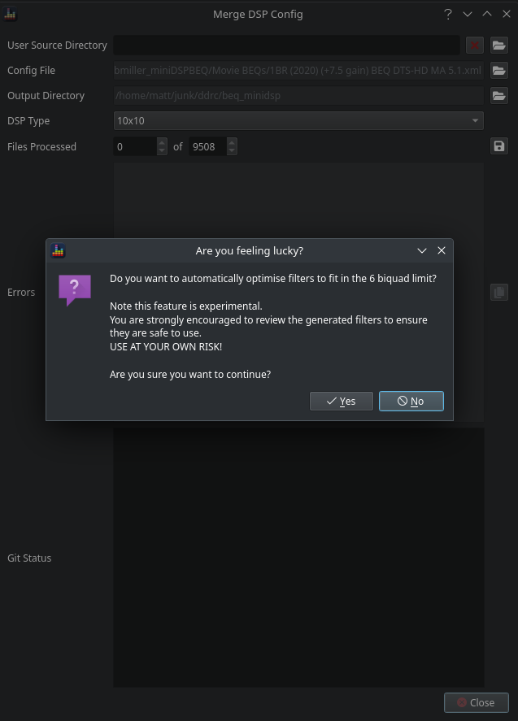
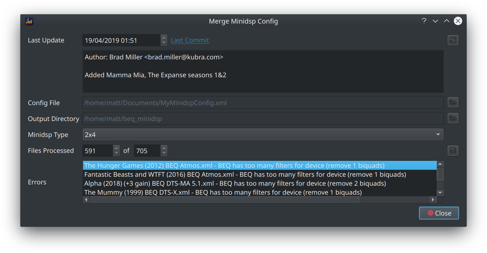
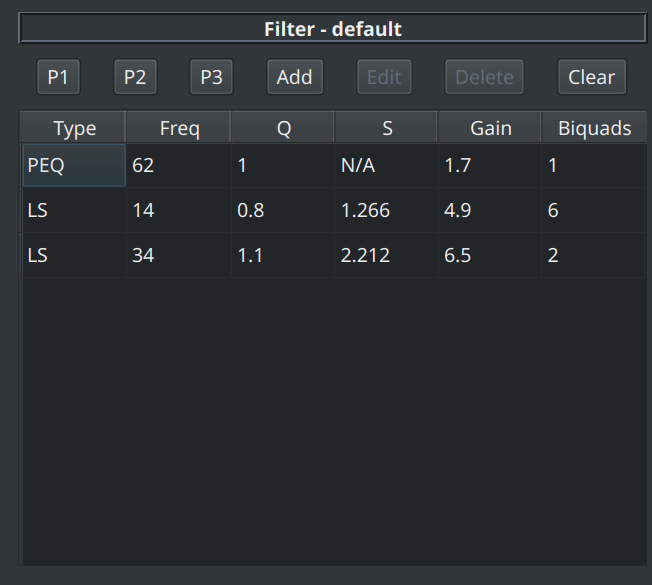
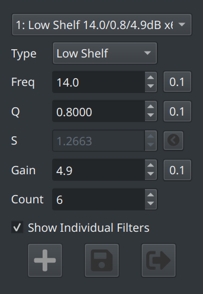
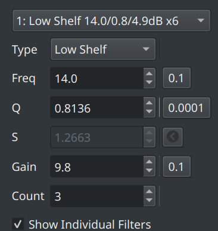

BEQDesigner provides support for the most commonly used mechanism for applying BEQ filters

  1. the published filters which are curated by AVS community member [DesertDog](https://www.avsforum.com/forum/members/7429388-desertdog.html) via his [github repo](https://github.com/bmiller/miniDSPBEQ)
  2. application of those filters to supported hardware

### Prerequisites

  1. You are using a supported device
    * [Minidsp 2x4](https://www.minidsp.com/products/minidsp-in-a-box/minidsp-2x4) (either balanced or unbalanced)
    * [Minidsp 2x4 HD](https://www.minidsp.com/products/minidsp-in-a-box/minidsp-2x4-hd)
    * [Minidsp 10x10 HD](https://www.minidsp.com/products/minidsp-in-a-box/minidsp-10x10-hd)
    * [Minidsp SHD](https://www.minidsp.com/products/streaming-hd-series/shd)
    * [Minidsp 88BM](https://www.minidsp.com/products/dirac-series/ddrc-88bm)
    * [Monoprice HTP-1](https://www.monoprice.com/product?p_id=37887)
    * [JRiver Media Centre](https://jriver.com/) (v27.0.46 or higher)    
  2. You have exported your existing configuration to a file (XML for minidsp, json for HTP-1, dsp for JRiver)

This function is not for you if you do not meet these requirements.

### Instructions

Hit the `Tools > Merge BEQ` menu item or press `CTRL+X` to open the dialog. It will then downloaded the latest version of the [beqcatalogue](https://beqcatalogue.readthedocs.io/en/latest/).

The next steps are:

* click the button next to the config file and pick your config file
* change the output directory as necessary
    * note that BEQDesigner will create a new directory in whichever directory you pick in order to try to avoid clashing with any existing files
* pick your device from the dropdown
* pick the channels to which the BEQ filters will be written to  
* click the Save button (in the *Files Processed* row)

!!! warning
    BEQDesigner will ask for confirmation if the output directory contains any files matching the extension of your configuration file. 

    * If you click Yes, all such files will be deleted
    * If you click No, no files will be deleted and BEQDesigner will take no further action 
 
If you clicked Yes, the following events should now happen:

* The count of files processed should increase rapidly
* The save button should change to a spinner which continues to spin

If the selected minidsp type is either the 2x4 or the 10x10 HD then the following option will be offered as the hardware only supports 6 biquads per output channel and some BEQ filters require more than 6 biquads.

If no is selected then errors should be expected. The error section will specify which files were not processed successfully and how many biquads you'd need to eliminate to use this directly. 
A suggested workaround is found [below](#working-around-fixed-point-hardware-limitations).

For other DSP device types, all files should be processed successfully

!!! info
    If any other errors are encountered, raise an issue via [github issues](https://github.com/3ll3d00d/beqdesigner/issues) to discuss further

### Working around Fixed Point Hardware Limitations

The limitations of the 2x4 and 10x10HD hardware make it hard to give precise guidance however some general principles apply.

Firstly load the filter into BEQDesigner using `File > Add BEQ Filter` or `CTRL+SHIFT+B`

Typically there will be 2 ways to reduce the biquad count. At the time of writing, *A Star is Born* is a good example of both aspect.

#### Remove Offsetting PEQ

Some BEQs employ a small PEQ to offset the overshoot of the LS filters. Try removing this PEQ to see if the effect is small.

In the *A Star is Born* example, the PEQ at 62Hz is such a filter.

#### Reduce LS Filter Stacking

Many BEQs stack multiple low shelf filters in order to reduce the magnitude of the overshoot. If such a filter is present, try the following:

* click edit on the filter
* make a note of the S value

* calculate the total gain by count * gain (+29.4dB in this example)
* reduce the count and increase the gain to maintain the same total gain while reducing the total biquad count as necessary (e.g. count = 3 and gain = 9.8)
* increase the Q value until S returns to approximately the previous value (where approximately means +/- 0.001)

* if the Q value has not changed too much (e.g. a change of less than <0.1) then the final response should be very similar however you will need to review this visually to be sure

!!! warning
    There are 2 possible problems with this approach
    
    1. the minidsp UI only accept Q values with 1 decimal place, you will most likely need to convert these filters to custom biquads in order to import them
    2. some LS filters are at ULF frequencies and the 2x4 hardware has precision issues in this region, be careful when translating this to your own hardware
