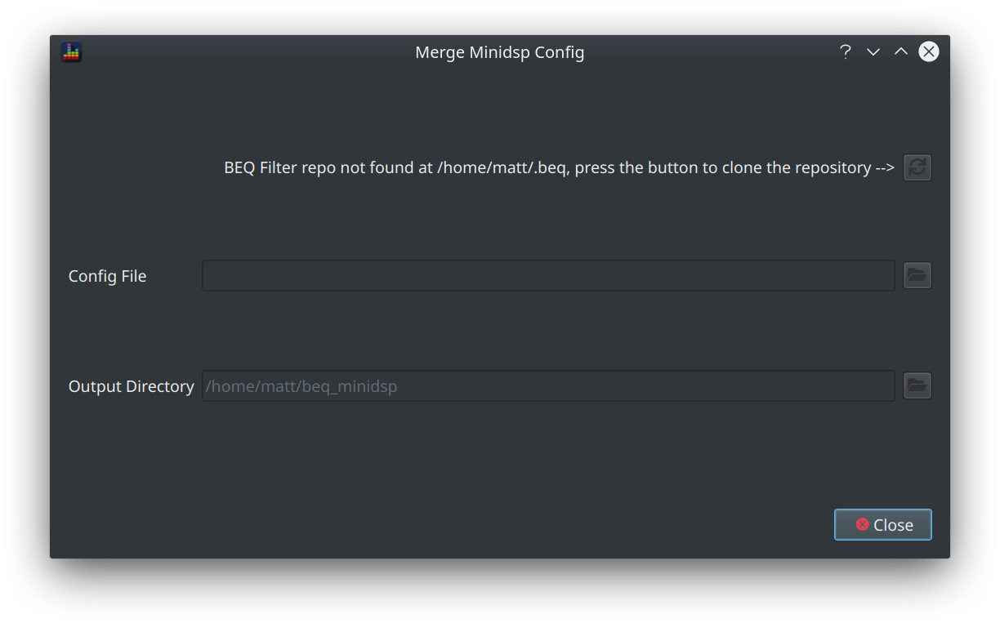
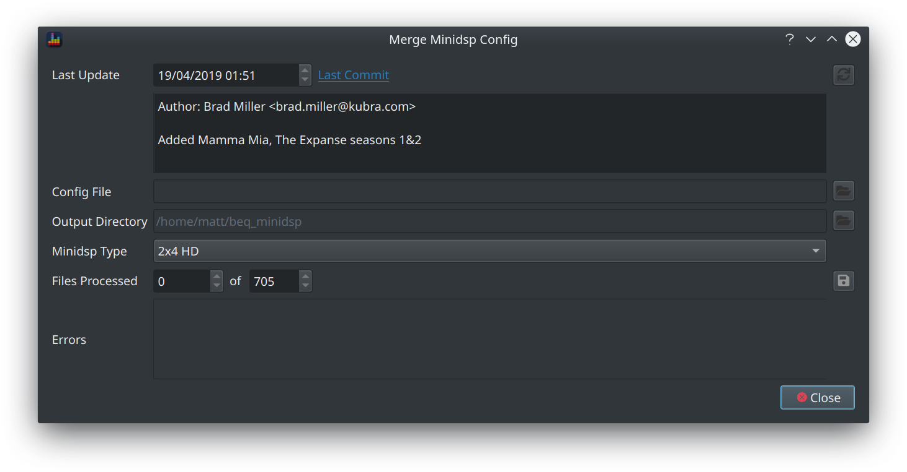
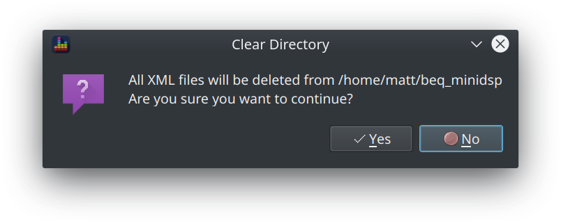
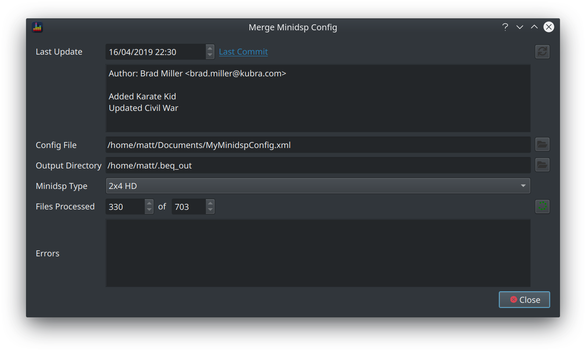
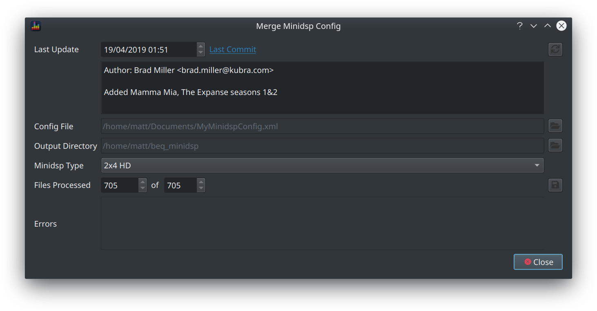
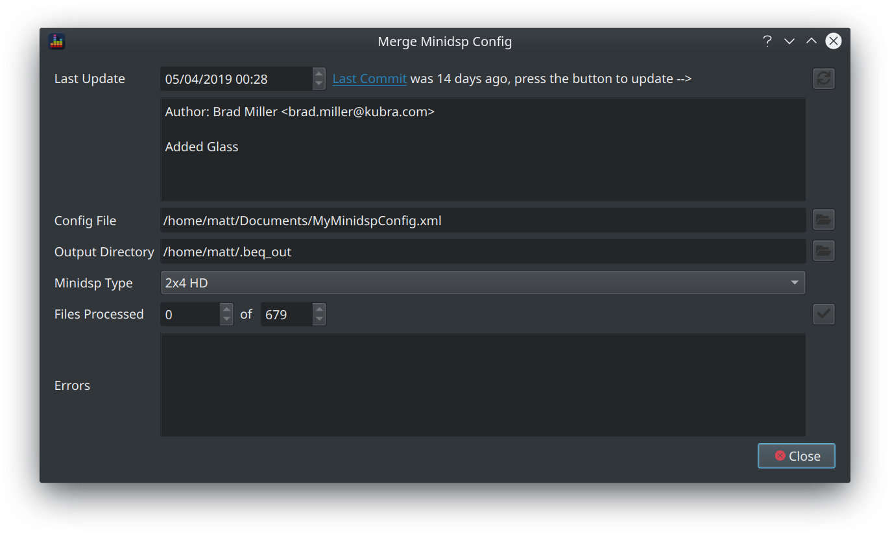

BEQDesigner provides support for the most commonly used mechanism for applying BEQ filters

  1. the published filters which are curated by AVS community member DesertDog via his [github repo](https://github.com/bmiller/miniDSPBEQ)
  2. application of those filters to the minidsp hardware 

### Prerequisites

  1. You are using a minidsp 2x4 or 2x4 HD
  2. You do not use the input EQ slots (PEQ_1 and PEQ_2 in the xml configuration file)
  3. You have exported your existing configuration via the minidsp UI to an XML file

This function is not for you if you do not meet these requirements.

### Instructions

Hit the `Tools > Merge MiniDSP XML` menu item or press `CTRL+X` to open the dialog.

On first use, the dialog will state that no filter files have been found and instruct you to hit the button.

Clicking the button will instruct BEQDesigner to connect to github and clone the repository, i.e. you will need network access at this point. Once the repository is cloned, the view will change to show 

* how many filters are available in the repository
* when it was last updated
* the last commit message

Next

* click the button next to the config file and pick your XML config file
* pick your minidsp device from the dropdown
* click the tick button 

!!! warning
    BEQDesigner will ask for confirmation as the entire output directory **will** be deleted, do not store anything else in this directory!
 
* click OK to continue

The count of files processed should increase rapidly and the error field should remain empty

This should ultimately show all files have been processed successfully

!!! info
    If any errors are encountered, raise an issue via [github issues](https://github.com/3ll3d00d/beqdesigner/issues) to discuss further

### Keeping the Repository Up to date

BEQ community member aron7awol cranks out new filters at a rate of knots so the repository is regularly updated. 

If more than 7 days have passed since the last commit found locally then BEQDesigner will prompt you to update your local copy

