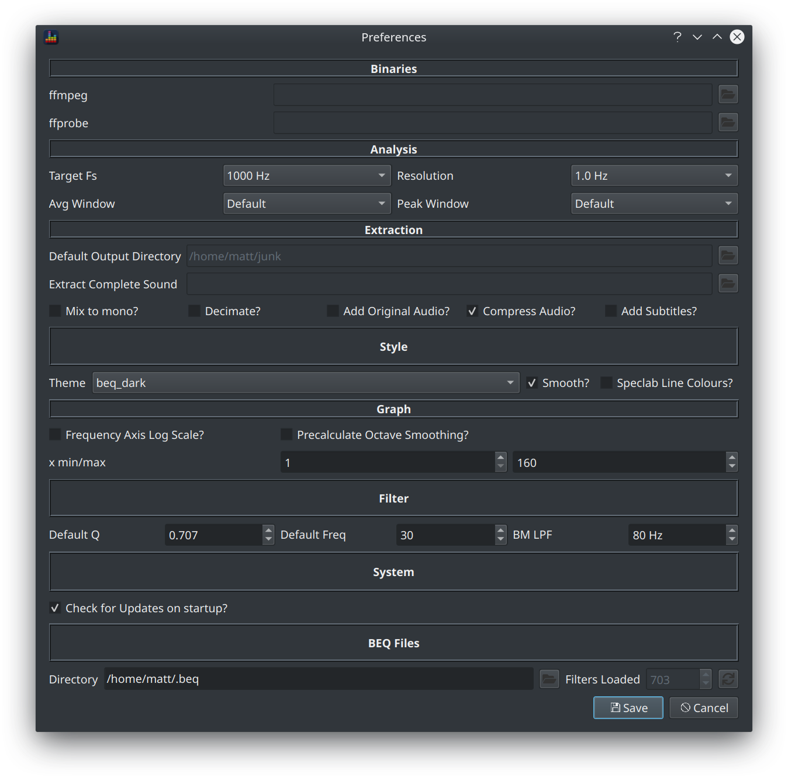

The Preferences dialog is accessible via the `Settings > Preferences` menu option or via the `CTRL+P` keyboard shortcut.

### Binaries

BEQDesigner uses [ffmpeg](https://ffmpeg.org/) for all AV file processing such as audio extraction or remuxing. It uses ffmpeg for the actual processing and ffprobe for discovering information about the file.

If ffmpeg is not on your `PATH` (which typically means you are a Windows user) then set the location here.

### Analysis

These options control how audio files are presented for analysis and are applied only when a signal is added.

* Target Fs: sets the sample rate to use when audio is decimated (either when adding a signal or extracting audio)
* Resolution: determines the FFT length used in the STFT analysis, the FFT length will be set to aim for the chosen frequency resolution. The actual resolution is constrained by the requirement for a power of 2 FFT length, for example if the sample rate is 1000Hz and the target is 1.0Hz resolution then the FFT length will be 1024 and the actual frequency resolution will be 1000/1024 = 0.976Hz. Alternatively if the sample rate is 48kHz and the target is 1.0Hz then the FFT length will be 65536 and the actual resolution will be 48000/65536 = 0.732Hz
* Avg/Peak Window: a list of window types is presented corresponding to the [scipy window functions](https://docs.scipy.org/doc/scipy/reference/signal.windows.html#module-scipy.signal.windows), a description of how different window types behave is outside the scope of this guide.

!!! warning
    These options should be left at the default values for all known BEQ purposes.
    
### Extraction

These options set some defaults for the [Extract Audio](./extract_audio.md) dialog.

* Default Output Directory: default location for extracted audio files
* Extract Complete Sound: if an audio file is set here, the file will be played whenever audio extraction completes
* All remaining checkboxes: sets the default state of the named checkboxes

### Style

These options influence the look and feel of BEQDesigner.

* Theme: different colour schemes for the various charts, does not apply to the waveform view.
* Smooth?
  * if unchecked, simple line graphs are drawn to join from one point to the next hence graphs will have a slightly 'spiky' appearance.
  * if checked, an [interpolation method](https://docs.scipy.org/doc/scipy/reference/generated/scipy.interpolate.PchipInterpolator.html#scipy.interpolate.PchipInterpolator) is applied which retains an accurate shape while smoothing the edges slightly
* Speclab Line Colours?
  * a compatibility mode for speclab users, if checked each peak curve will be rendered in a shade of red while the average will be in a shade of green.
  * if unchecked, peak and average for each signal will be the same colour but colours for each signal will vary accordingly to the theme. 
  * as a rule of thumb, speclab mode is easier to read when viewing a single signal only but becomes unreadable when you have many signals (e.g. a multichannel audio track)

### Graph

These options set defaults for the magnitude graph layout

* Frequency Axis Log Scale? : if checked, use a log scale otherwise linear
* Precalculate Octave Smoothing
  * if checked, all fractional octave curves will be precomputed when the signal is added
  * if unchecked, the smoothed view is calculated as the option changes
* x min/max: default x axis range for graphs

### Filter

These options set defaults for the corresponding controls on [Filter Design](./add_filter.md) dialog 

* Default Q
* Default Freq

This option sets the frequency for the low pass filter applied in the [Bass Management Simulation](../workflow/bass_management.md)

* BM LPF

### System

Check the *Check for updates on startup?* option to allow BEQDesigner to query the github releases api on startup. If the latest release is not the current release, an alert will be shown to notify you.

### BEQ Files

Manages the github repo which contains the BEQ filters created by [aron7awol on avsforum](https://www.avsforum.com/forum/members/8588090-aron7awol.html).

* Directory: the location to which to clone the repo
* Filters Loaded: shows how many filters are present in the directory
* Sync button: click to update the repo to the latest commit

### Where are preferences stored?

Settings are stored using a [Qt feature](https://doc.qt.io/qt-5/qsettings.html#locations-where-application-settings-are-stored) so the location is OS specific.

* Windows: in the registry under `HKEY_CURRENT_USER\Software\3ll3d00d\BEQDesigner`
* Linux: in `3ll3d00d/BEQDesigner.conf` in a directory specified by `$XDG_CONFIG_DIRS` (for example, on KDE this is $HOME/3ll3d00d/BEQDesigner.conf)
* OSX: in `$HOME/Library/Preferences/3ll3d00d.BEQDesigner.plist`
