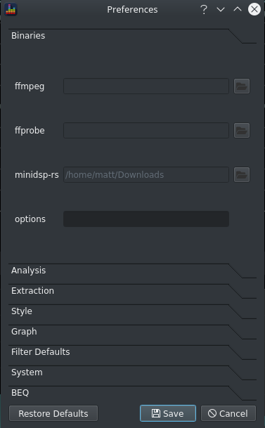
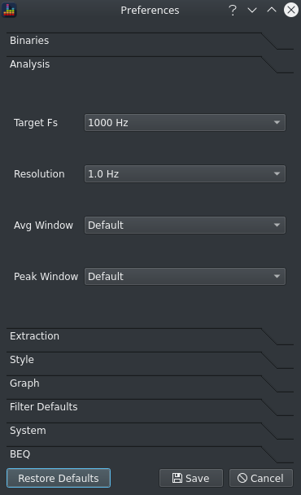
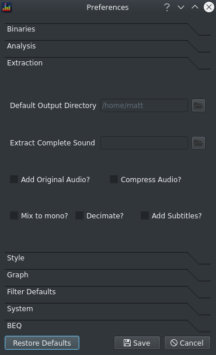
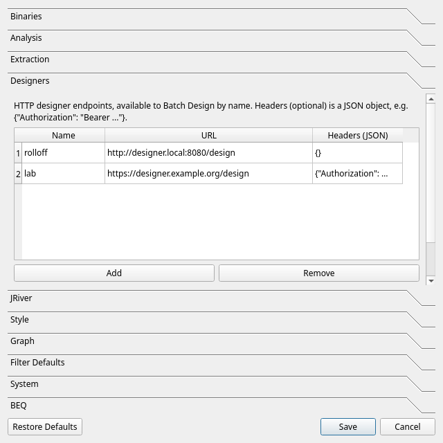
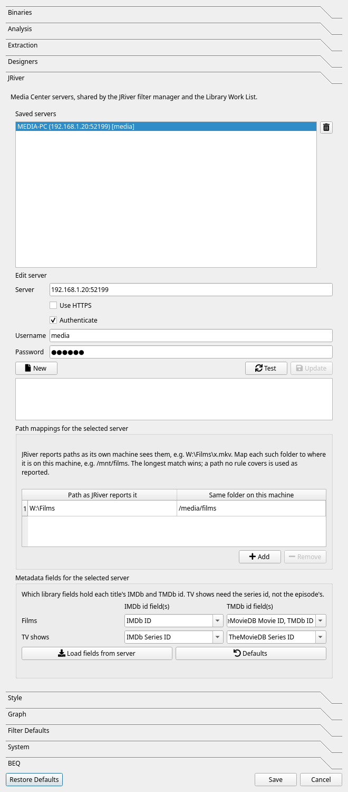
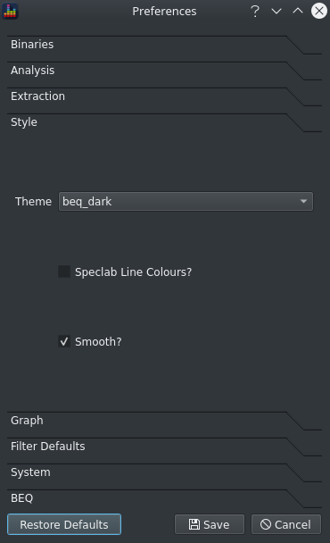
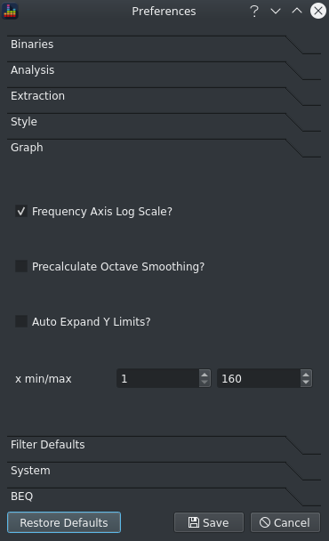
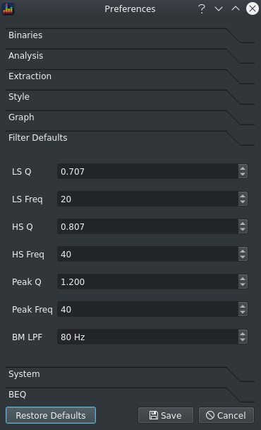
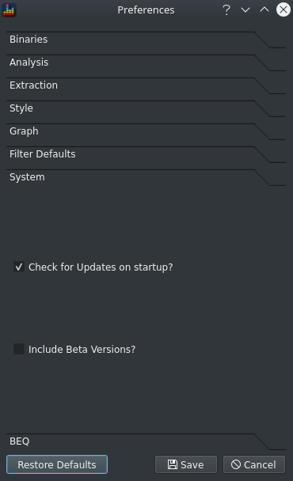
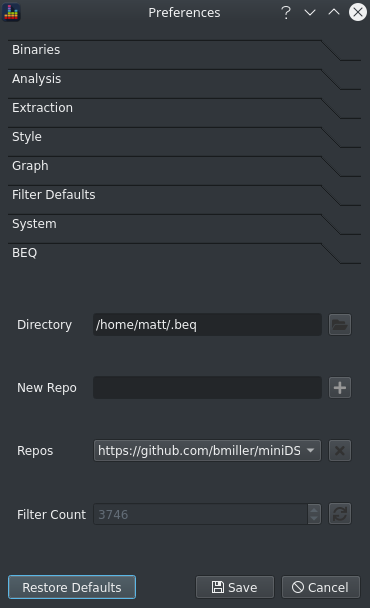

The Preferences dialog is accessible via the `Settings > Preferences` menu option or via the `CTRL+P` keyboard shortcut.

### Binaries

The binaries sheet allows the location of optional 3rd party binaries to be configured.

#### ffmpeg

BEQDesigner uses [ffmpeg](https://ffmpeg.org/) for all AV file processing such as audio extraction or remuxing. It uses ffmpeg for the actual processing and ffprobe for discovering information about the file.

If ffmpeg is not on your `PATH` (which typically means you are a Windows user) then set the location here.

#### minidsp-rs

BEQDesigner can use [minidsp-rs](https://github.com/mrene/minidsp-rs) to load filters into a minidsp 2x4HD. 

### Analysis

These options control how audio files are presented for analysis and are applied only when a signal is added.

* Target Fs: sets the sample rate to use when audio is decimated (either when adding a signal or extracting audio)
* Resolution: determines the FFT length used in the STFT analysis, the FFT length will be set to aim for the chosen frequency resolution. 
    * The actual resolution is constrained by the requirement for a power of 2 FFT length, for example if the sample rate is 1000Hz and the target is 1.0Hz resolution then the FFT length will be 1024 and the actual frequency resolution will be 1000/1024 = 0.976Hz. 
    * If the sample rate is 48kHz and the target is 1.0Hz then the FFT length will be 65536 and the actual resolution will be 48000/65536 = 0.732Hz
* Avg/Peak Window: a list of window types is presented corresponding to the [scipy window functions](https://docs.scipy.org/doc/scipy/reference/signal.windows.html#module-scipy.signal.windows), a description of how different window types behave is outside the scope of this guide.

!!! warning
    These options should be left at the default values for all known BEQ purposes.
    
### Extraction

These options set some defaults for the [Extract Audio](./extract_audio.md) dialog.

* Default Output Directory: default location for extracted audio files
* Extract Complete Sound: if an audio file is set here, the file will be played whenever audio extraction completes
* All remaining checkboxes: sets the default state of the named checkboxes

### Designers

A *designer* is an HTTP service that proposes BEQ filters for an audio track. Designers are used by the [design step of Extract Audio and Batch Extract](./batch_extract.md#designing-filters) and by the [Library Work List](../library/index.md). This page lists the ones you can use.

* Name, URL and Headers (JSON): one row per designer, added with *Add* and removed with *Remove* (select a row first). Headers are optional and must be a JSON object, for example `{"Authorization": "Bearer ..."}`. The name is what you choose from wherever a designer is picked, where it is shown as `http:<name>`. Names must be unique and each row needs both a name and a URL.
* Review Queue Directory: the default folder that the design step of Extract Audio and Batch Extract writes its results to, and the folder the [Review Folder](../library/review.md#review-folder) window opens. The Library Work List has its own review queue, set in its [settings](../library/setup.md#locations).
* Default Designer: the designer that is selected by default. The list is filled in when the dialog opens, so a designer you have just added appears here the next time you open Preferences.

The rows are checked when you press Save. If a row is not valid (a name without a URL, headers that are not a JSON object, a duplicate name) a message lists the problems, the designers are left as they were, and everything else on the page is still saved. The controls for designing in Extract Audio and Batch Extract only appear once at least one designer has been added.

### JRiver

The Media Center servers that BEQDesigner can talk to. They are shared by the [JRiver filter manager](./manage_mc.md), which downloads and uploads DSP configurations, and the [Library Work List](../library/setup.md#sources), which reads a movie library from one.

*Saved servers* lists them by the name the server gives itself, its address and the user, for example `MEDIA-PC (192.168.1.20:52199) [media]`. Changes are written as soon as you make them, without pressing Save.

To add a server, fill in the form and use *Test* and then *Add*:

* Server: the address as `host:port`, for example `192.168.1.10:52199`.
* Use HTTPS, and Authenticate with a Username and Password if the server needs one. The password is stored in the application's settings, not encrypted.
* *Test* checks the connection (in the background, so a server that is down does not freeze the dialog). *Add* is only enabled once a test has passed.

Select a saved server to change or delete it. The form then edits it (*Add* becomes *Update*), *New* clears the selection to add another, and the bin button beside the list deletes the selected one. The last two groups apply to the selected server:

* **Path mappings**: JRiver reports file paths as the machine running Media Center sees them, for example `W:\Films\x.mkv`. Map each such folder to where it is on this computer, for example `/mnt/films`, so the library's files can be found. The longest matching rule wins and a path that no rule covers is used as reported. A wrong mapping shows up as an extraction that fails with *file not found*.
* **Metadata fields**: which library fields hold each title's IMDb and TMDb id, for films and for TV shows (a TV show needs its series id, not the episode's). The defaults suit most libraries. *Load fields from server* lists the fields your library defines, and *Defaults* goes back to the defaults.

!!! note
    When you add a JRiver source to the Library Work List, the server's login, path mappings and metadata fields are **copied** into the source. Changing them here later does not change a source that already exists: edit the source, which then offers to take the current values.

### Style

These options influence the look and feel of BEQDesigner.

* Theme: different colour schemes for the various charts, does not apply to the waveform view.
* Smooth?
    * if unchecked, simple line graphs are drawn to join from one point to the next hence graphs will have a slightly 'spiky' appearance.
    * if checked, an [interpolation method](https://docs.scipy.org/doc/scipy/reference/generated/scipy.interpolate.PchipInterpolator.html#scipy.interpolate.PchipInterpolator) is applied which retains an accurate shape while smoothing the edges slightly
* Speclab Line Colours?
    * a compatibility mode for speclab users, if checked each peak curve will be rendered in a shade of red while the average will be in a shade of green.
    * if unchecked, peak and average for each signal will be the same colour but colours for each signal will vary accordingly to the theme. 
    * as a rule of thumb, speclab mode is easier to read when viewing a single signal only but becomes unreadable when you have many signals (e.g. a multichannel audio track)
* Image Format
    * the default format to use when exporting as a image, choice of png or jpg 

### Graph

These options set defaults for the magnitude graph layout

* Frequency Axis Log Scale? : if checked, use a log scale otherwise linear
* Precalculate Octave Smoothing
  * if checked, all fractional octave curves will be precomputed when the signal is added
  * if unchecked, the smoothed view is calculated as the option changes
* Auto Expand Y Limits? : if checked, the y axis range will automatically expand to fit all visible data on screen (when the graph is in auto ranging mode)
* x min/max: default x axis range for graphs

### Filter Defaults

These options set defaults for the corresponding controls on [Filter Design](./add_filter.md) dialog 

* Default Q and Frequency for each commonly used filter type (low shelf, high shelf, peaking) 
* BM LPF: sets the frequency for the low pass filter applied in the [Bass Management Simulation](../workflow/bass_management.md)

### System

Check the *Check for updates on startup?* option to allow BEQDesigner to query the github releases api on startup. 

Check the *Include Beta Versions?* option to be notified when new prerelease versions are published.

If the latest release is not the current release, an alert will be shown to notify you.

### BEQ

* Directory: the location to which the BEQ catalogue and its filter files are downloaded, used by [Browse BEQ Catalogue](./catalogue.md) and [Merge BEQ](./merge_beq.md). The default is a `.beq` folder in your home directory.

This is not where the [Library Work List](../library/index.md) publishes. The catalogue repositories that it writes to are set in the work list's [settings](../library/setup.md#the-two-repositories).

### Where are preferences stored?

Settings are stored using a [Qt feature](https://doc.qt.io/qt-5/qsettings.html#locations-where-application-settings-are-stored) so the location is OS specific.

* Windows: in the registry under `HKEY_CURRENT_USER\Software\3ll3d00d\BEQDesigner`
* Linux: in `3ll3d00d/BEQDesigner.conf` in a directory specified by `$XDG_CONFIG_DIRS` (for example, on KDE this is $HOME/3ll3d00d/BEQDesigner.conf)
* OSX: in `$HOME/Library/Preferences/3ll3d00d.BEQDesigner.plist`
