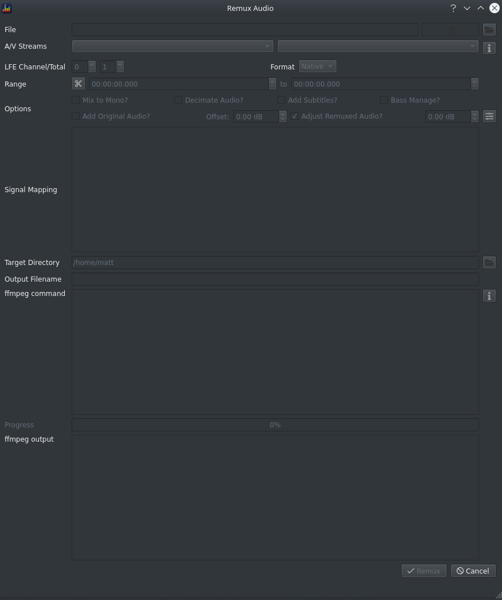

The Remux Audio dialog allows you to apply filters to an audio track and create a new file containing a video track, the filtered audio and, optionally, the original audio track. 

!!! info
    Most options behave the same as found in [Extract Audio](./extract_audio.md) so only options specific to remuxing will be covered here.
    
### Prerequisites

  1. You have a set of filters to apply 
  2. You understand which channels to map those filters to
  3. You understand what, if any, gain adjustments are required to avoid clipping
  4. You have the source file containing the video and audio you want to put into the output
  5. You don't care about Immersive Audio content

### Approach

  1. Load the required channels as signals
  2. Apply filters as necessary
  3. Open the Remux dialog using `Tools > Remux Audio` or `CTRL+U`
  4. Select the source file 
  5. Pick the desired audio and video tracks
  6. Ensure the following options are unchecked
    * Mix to Mono
    * Decimate
  7. Select other options as desired
    * Add Subtitles
    * Add Original Audio
    * Format
  8. Apply volume offsets to the remuxed audio and/or original audio tracks as desired
  9. Update the mapping of filter channels to source audio channels via the *Signal Mapping* dialog
  

  10. Set the output directory and filename
  11. Click Remux
  12. Sit back and wait for the processing to complete
    
!!! warning
      * ffmpeg does not handle all subtitles so choosing this option may produce unrecoverable errors while remuxing.
      * ffmpeg only supports 5.1 output when compressing audio using EAC3 
      * some playback devices do not support 7.1 audio encoded to FLAC

  
