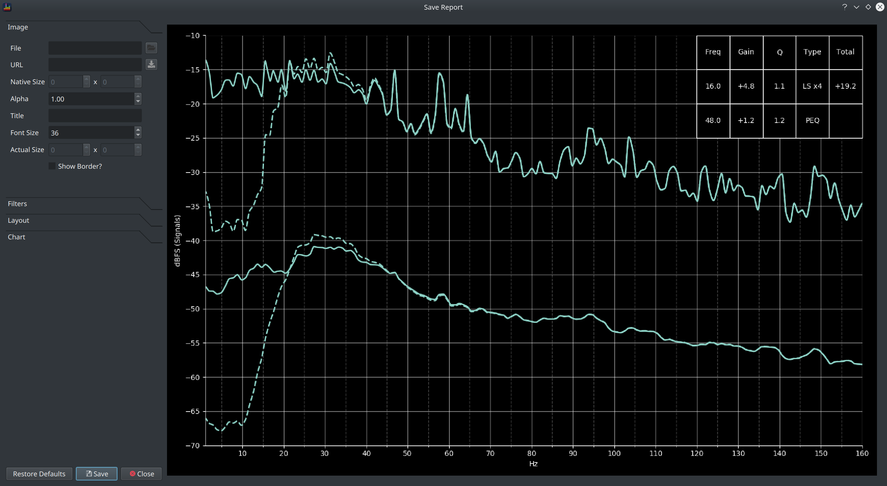
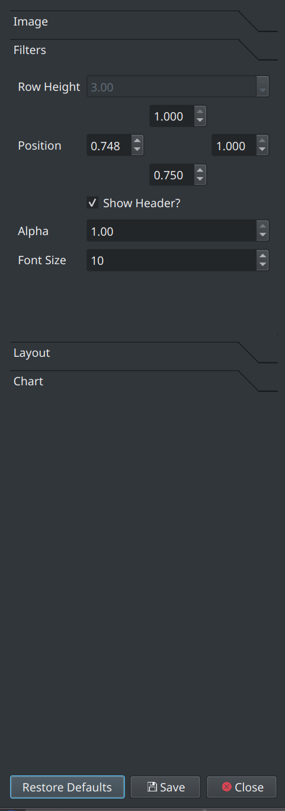
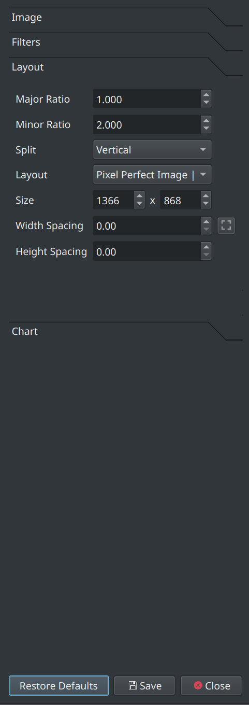
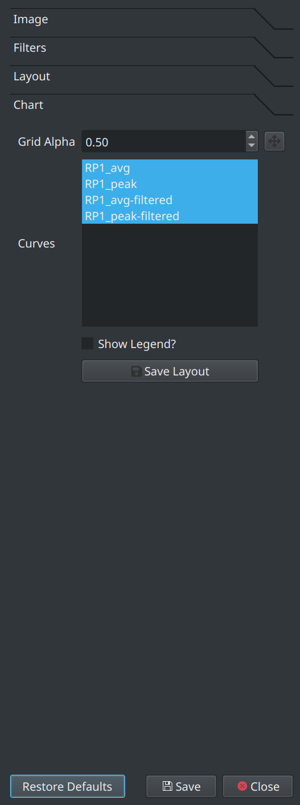

`File > Save Report` (or hit `CTRL+R`) provides a way to share a BEQ in the style used in the [avsforum beq thread](https://www.avsforum.com/forum/113-subwoofers-bass-transducers/2995212-bass-eq-filtered-movies.html)

A report is composed of 3 elements

  1. (optional) An image of your choosing (typically an appropriate film poster)
  2. the peak/average response(s) (typically with and without filters applied)
  3. a table printout of the filters applied
  
The 3 elements can be arranged in various layouts as described below. 

### Report Dimensions

The report is created from the on screen rendering so screen and window size is very important. A larger screen is good thing here as a small and low resolution screen is unlikely to yield attractive results.

### The Report Dialog

The dialog shows a preview of the report on the right and the controls which allow the report design to be tailored on the left. There are many options so they are grouped into expandable sections.

Once the report is configured to your preference, click the Save button to export it to an image.

### Report Controls

A brief overview of each option will be provided. This is a mechanism for creating a visual report though so users are encouraged to play around with the options to see how they behave.

#### Image

An image can be loaded from a file or via a URL to some publicly available content. 

To load from a file, click the button next to the File field and select the file.
To load from a URL, paste the URL into the URL field and click the button to download it.

Once a file is loaded, the image size will be shown in the *Native Size* fields. The actual rendered image size will be shown in the *Actual Size* fields. The Actual Size will most likely differ from the native image size unless the *Pixel Perfect Image* layout is used.

The *Alpha* option is intended for use with layouts that embed the image into the chart, lower alpha values make the image increasingly transparent.

A title can be added via the *Title* field, the size of font used for the title is controlled via the *Font Size* selector.

The *Show Border* option is used to draw a thin outline around the image.

#### Filters

These options control the position and layout of the filter table.

The *Position* fields specify the coordinates of the bounding box where 0.0 is the bottom or left and 1.0 is the top or right of the area.

*Alpha* controls the opacity of the table.
*Font Size* and *Row Height* control the size of the text/table.

#### Layout

The layout options control:

* how big the exported report is
* the layout of the 3 components in a report
* the relative size and positions of those components

Experiment with these options to see how they behave.

!!! info
    All reports shared on avsforum use the *Pixel Perfect Image | Chart* layout
    
#### Chart

The chart options control which curves should be shown in the report. It defaults to all loaded signals with both peak and average.

Click *Save Layout* to save the currently selected set of options for subsequent reuse.

