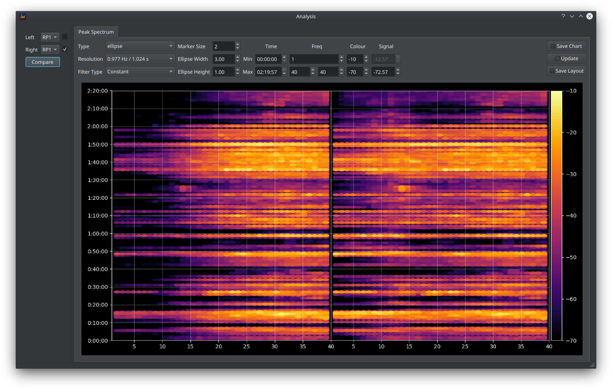
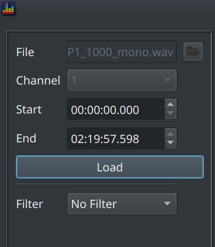
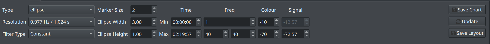

The *Spectrum* view provides a more detailed view of an audio track via a form of Spectrogram view. It plots frequency on the x axis, time on the y axis and shows the strength of the signal via the colour scheme. Different options for exactly how to render the colours are provided as well as the ability to compare two different tracks side by side.

### How to open the Spectrum view

This view is accessible in two places.

#### Comparing Signals

To compare loaded signals, click the button in the [Waveform](./waveform.md) controls section.

The controls in the top left allow you to select two signals to compare, this can be 2 different tracks or a comparison of a filtered vs unfiltered track. Check the checkbox to apply filters to that signal.

#### Analysing Audio Files

To compare content from external audio files, enter via the `Tools > Analyse Audio` menu item

This option provides the ability to see the content in that file

The Filter dropdown allows you to apply a currently loaded filter to the signal and compare to the unfiltered signal.

!!! info
    This option is an early implementation of what became the [Waveform](./waveform.md) view. 
    
### Chart Controls

Many options are provided to refine how the content is presented. These are all collected together in a toolbar above the chart.

#### Display Options

The data behind a spectrogram is basically a table of values (like a spreadsheet) where each value is the magnitude at a given frequency and time period. When plotted as a chart, each *cell* is given a colour that varies according to that magnitude. Different ways of rendering each cell can therefore yield a very different look.

##### Type

The *Type* field controls this aspect of the display. 

Assorted other fields are enabled depending on the type selected to further refine the way the cell is rendered. These options are:

Type | Applicable Options | Description
-----|--------------------|------------
Point | Marker Size, Filter Type | Each cell is rendered as a circle, the radius of the circle is scaled by the Marker Size value
Ellipse | Marker Size, Ellipse Width/Height, Filter Type | Each cell is rendered as an ellipse, the size of which is scaled by the Marker Size and the width/height ratio is specified by the other options
Spectrogram (contoured) | Marker Size | A smooth mesh is fitted on top of the cell values to produce a more gradual transition from one cell to the next
Spectrogram (flat) | None | Each cell is filled with a flat colour and sized strictly according to the size of the chart

!!! info
    There is no right or wrong type to choose but we can make some recommendations
    
      * The Point and Ellipse options are variations on a spectrogram which are designed to focus attention on areas where the signal is strongest, i.e. that are demo worthy
      * If using Point or Ellipse, aim to minimise (or eliminate) the blank area between cells and hence use Point when your chart is physically quite square and ellipse if it is more rectangular
      * The spectrogram view is difficult to read with long signals (i.e. entire movie soundtracks) as each cell is too small, it can also be extremely slow to render. Restrict use of this option to shorter time periods (e.g. <10mins) for best results.

##### Understanding Filter Type

The *Filter Type* option is enabled for the *Point* and *Ellipse* markers and it has 3 options

* Constant
* Peak
* Average

This is referred to as a filter because it is filtering out some of the underlying data, the value selected controls how that filtering happens.

Remember that the underlying data is a table of values where each cell represents a magnitude at the specified frequency and time.

Notice that when a signal is loaded, the Signal column (the right most column of data) is populated with 2 values:

* the upper value is the peak magnitude found at any time or frequency in the entire track
* the lower value is 60dB below the peak by default but is editable

The *Constant* filter simply filters out all values below that specified lower value.

Change the type to *Peak* and notice that the peak value disappears, there is now just a single value which is set by default to -60.00dB.

The *Peak* filter is filtering out all content that is more than that value less than the peak **for that frequency**

Change the type to *Average* and notice that now the lower value disappears and there are no controls available.

The *Average* filter is filtering out all content below the *average* response and this is the same average response visible in the main graphs, i.e. an *Average* filter is used to show only *above average* content.

!!! info
    These options are not available in the spectrogram view as that is intended to show **all** data regardless of level. 
    
#### Controlling the Chart Limits

The controls in the *Time* and *Freq* columns perform the same function as the [Limits Dialog](./main_window.md#Controlling-Graph-Limits) in that it restricts the visible content to the specified range.

There are 2 max frequency values when comparing signals as this allows different frequencies ranges to be compared. The split in the chart will move in proportion with the relative sizes of the frequency range, e.g if the left signal is set to 1-40Hz and the right is set to 1-80Hz then 1/3 of the chart will be used for the left signal and 2/3 for the right.

#### Updating the Chart

Rendering times for this view are typically quite slow so the chart is not rerendered on each update. Click the *Update* button to apply any changes and rerender the chart.

#### Save Chart

The *Save Chart* button allows you to save the chart as a png

#### Default Layout

Click *Save Layout* to store the current layout with the other [preferences](./preferences.md).
