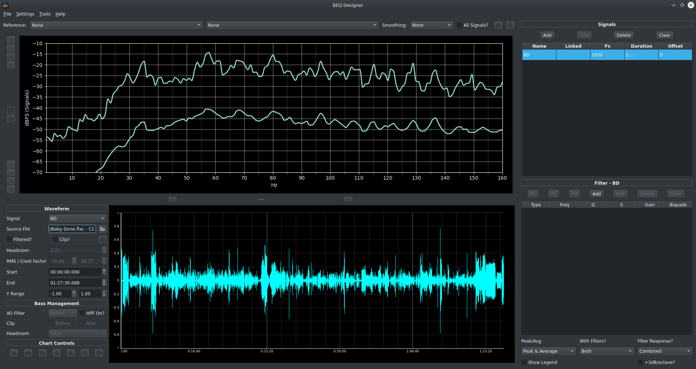

The Waveform view allows you to:

* see the effect of filters on the actual signal over time
* check whether the signal is clipping
* (if using multichannel audio files), simulate the effect of filters when using bass management

!!! warning
    This is a relatively complicated view with numerous options that interact with each other. 

### How to access the waveform view?

The waveform view is hidden by default, to see it lift the slider at the bottom of the main screen.

This slider can be dragged up and down as desired.

### Understanding the Waveform View

In this example, a 1kHz mono signal has been added and the waveform view opened

The view now shows the waveform itself in a separate chart with time on the x axis and magnitude (in dBFS) on the y axis. 

!!! warning
    Values beyond 1.0 can be handled by BEQDesigner but will result in clipping if exported to an actual audio file.

#### Interactive Charts

The chart is interactive in the sense that you can select an area using the mouse (click and hold the left button) to zoom in on, the chart will update in real time as you do this.

Further options are available via a right click menu.

#### Chart Controls

The 1st section of the control pane manages the presentation of the selected waveform

* Signal: shows a list of available signals
* Source File: shows the underlying filename of the selected signal, use the button to the right to change this file (typically used if you've reloaded a saved signal but have moved the underlying audio file in the meantime)
* Filtered?
    * if checked, the filters for this signal are applied to the waveform
    * if unchecked, the original signal is shown
* Clip?
    * if checked, the signal is hard clipped at full scale
* Headroom
    * shows the headroom in the signal in dB, i.e. the difference between the absolute peak sample value and 1.0
    * if a negative value is shown, this signal will clip
* Start/End: the visible range of the x axis, will update if the chart is zoomed interactively and will update the chart view if the value is changed in the field
* Y Range: the visible y axis range, will update if the chart is zoomed interactively and will update the chart view if the value is changed in the field

The 2nd section governs how the [bass management simulation](../workflow/bass_management.md) functions, refer to the linked document for details.

The final section is a list of buttons, from left to right

* Show Spectrum View: described in full details in [the associated page](./spectrum.md)
* Show Magnitude Response: analyses the currently visible time range of the signal and shows the peak/average for that time slice, the view is recalculated in realtime as the waveform time limits are changed
* Hide Magnitude Response: hides the above view
* Set Limits: shows the [Limits Dialog](./main_window.md#controlling-graph-limits) for the magnitude view
* Zoom In: resets the y axis limits to the min/max sample values
* Zoom Out: resets the y axis limits to +/- 1.0

