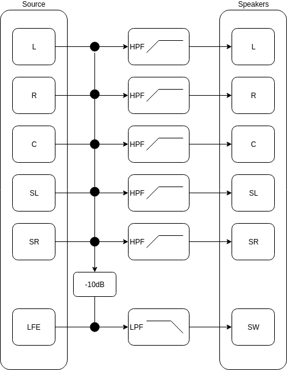

BEQDesigner includes a bass management simulation which can accurately simulate the effect of bass management on a multichannel audio track, both with and without filters. 

### Understanding Bass Management and the LFE Channel

A typical modern AV processor takes a signal through the following steps

  1. Create the SW output channel
    * for each main channel
        * copy the channel
        * attenuate by 10 + x dB
        * apply a low pass filter 
    * attenuate the LFE channel by x dB 
    * sum all channels
  2. Create the main output channels
    * apply a high pass filter to each main channel
    
Notice that the signal chain above includes an attenuation of x dB

* if x is too small, clipping is increasingly likely to affect any given track
* if x is large enough, the peak output voltage may be reduced which causes further problems downstream

There is therefore a tradeoff between these two concerns.
    
#### What can go wrong?

It is unfortunately not unusual for a modern AVP to be unable to complete this process without introducing distortion into the signal chain and/or behaving in some idiosyncratic way.

The most common problem is that the signal is clipped at some stage during processing, i.e. the device has left insufficient digital headroom to complete the process cleanly. Referring back to the value of x dB above, x = 5 is the most commonly used value.

##### Understanding Worst Case Signals

The hypothetical *Worst Case Signal* (WCS) for bass management is a coherent full scale (peak at 0dBFS) sine wave on every single channel concurrently. The total level can be calculated as follows 

* ΔL = level difference (in dB)
* n = no of coherent channels 

$$
ΔL = 20 * log(n)
$$

to sum the mains with the LFE (which is +10dB higher than a single main channel):

$$
20.0 * log((10 ^{ΔL / 20}) + (10 ^{10 / 20}))
$$

therefore, assuming a reference level of 105dB for a main channel, we have peak possible signal levels of 

* 5.1: 123.188dB
* 7.1: 125.839dB

##### How much headroom is really needed?

-5dB headroom is typically left for summing the main channels with the LFE however the analysis above shows that the worst case signal for a 7.1 track requires ~10dB headroom. Hardware employing -5dB will therefore clip when presented with such a signal.

Fortunately this sort of signal is non existent in real content. 

Some analysis of heavy hitting scenes has been posted on [data-bass](http://data-bass.ipbhost.com/topic/425-analyzing-waveforms-of-heavy-hitting-movies/) which suggests peak levels reach -2dB from WCS.

This implies a value of x = 8 is a practically safe level.

This leads to two questions

  1. how much content reaches above that 5dB level?
  2. if we stick to a 5dB attenation, how audible is the resulting clipping?
  
The bass management simulation attempts to give some objective data to inform this question.

### Simulating Bass Management

#### Getting Started

  1. Load a multichannel audio file with the [all channels](../ui/load_signal.md#loading-all-channels) option.
  2. Add filters as desired.
  3. Open the [waveform](../ui/waveform.md) view.
  
The *Signal* dropdown will now contain

* all individual channels
* a simulated bass managed signal denoted by the (BM) prefix

Select the *(BM)* signal to get started.

#### Simulation Options

There are 3 options

##### When is the low pass filter applied?

The *LPF* option controls when the LPF is applied, the options are:

* Before: the main channels are low passed before summation
* After: the channels are combined and the resulting output signal is low passed
* Off: no low pass filter is applied

##### Simulating Headroom

The *Headroom* option controls by how much the main channels are attenuated before summation, the options are:

* WCS: attenuate by enough to ensure the WCS signal can be summed without clipping (see above for calculations)
* -8 to -5 : a sliding scale of values that are progressively more likely to clip

##### Clipping

BEQDesigner operates in the digital domain alone so will not clip. This is not a realistic simulation of reality as such values eventually have to fit in a certain range. 

Two options are provided:

* Before: signals are clipped before summation
* After: signals are combined and then clipped

!!! info
    unfortunately there is no way to know, a priori, which option to choose for your own hardware without someone measuring the device. 
