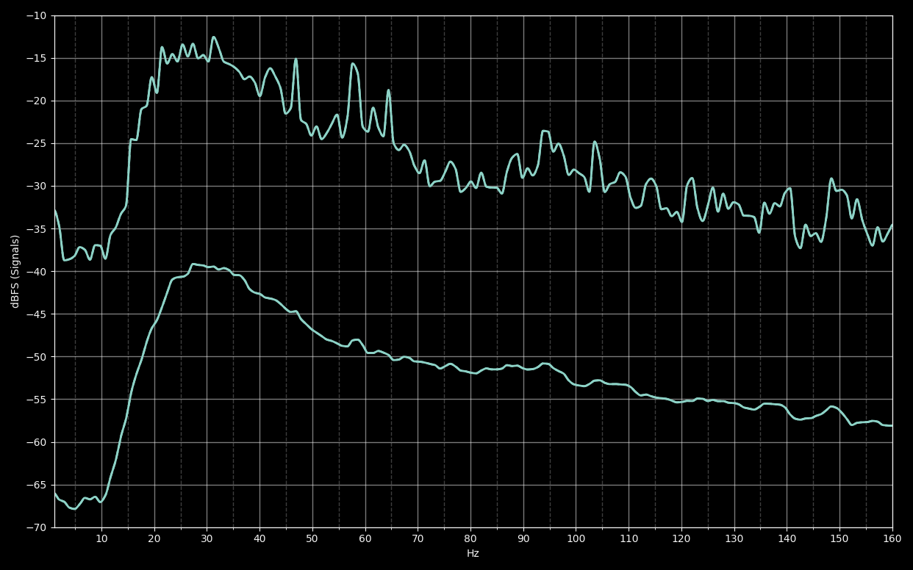
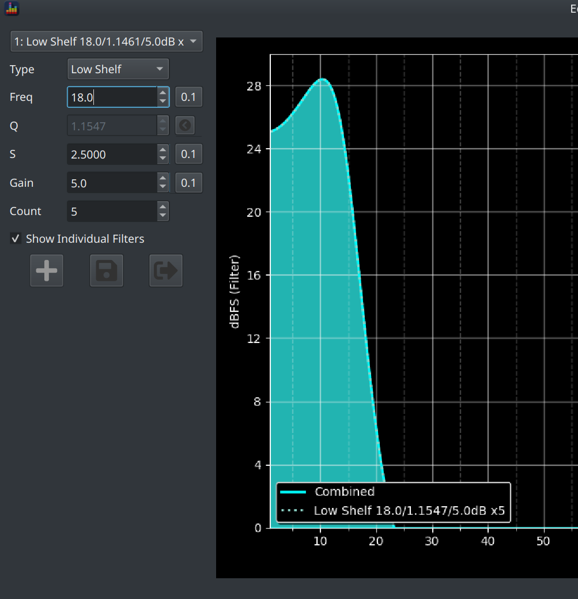
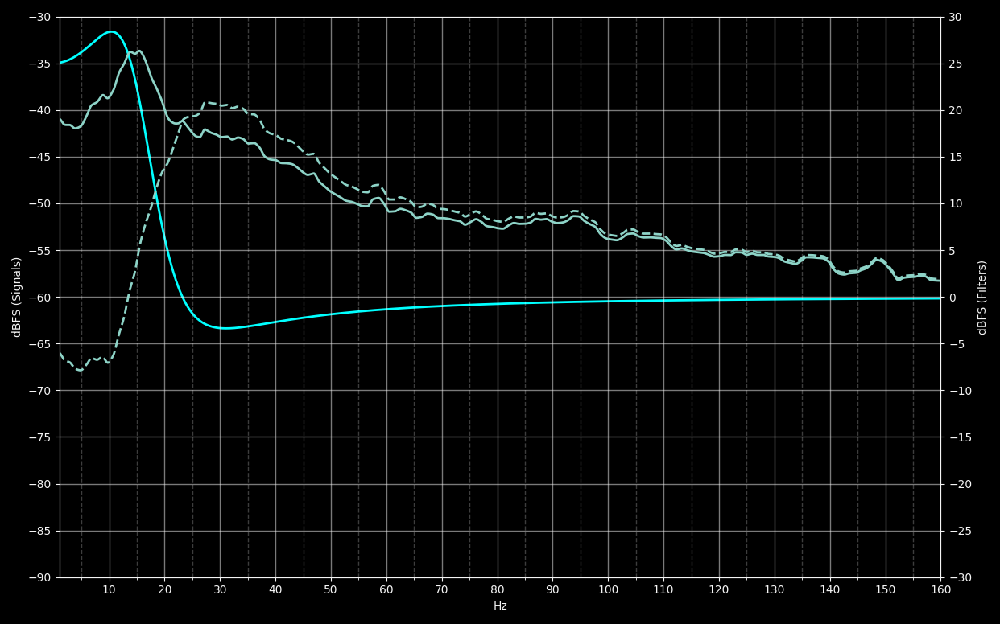
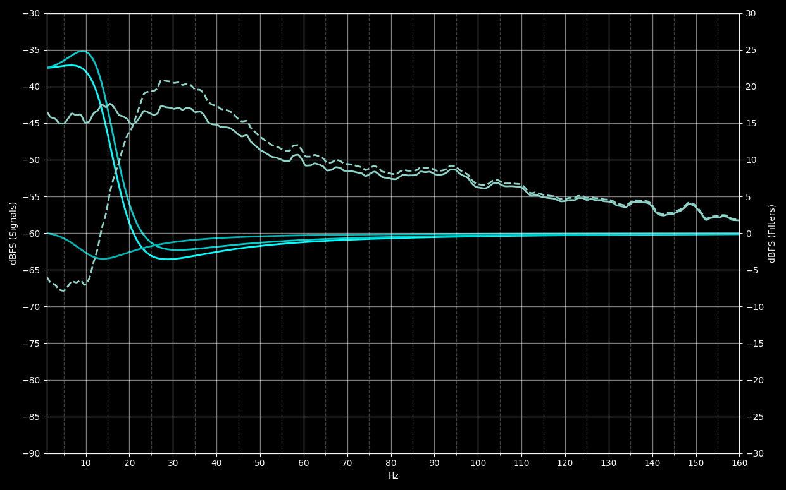
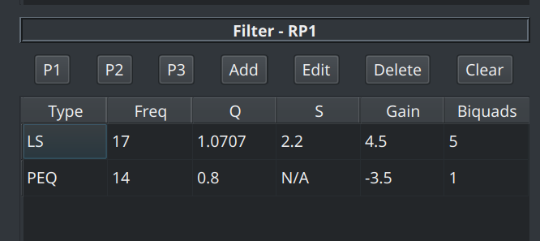
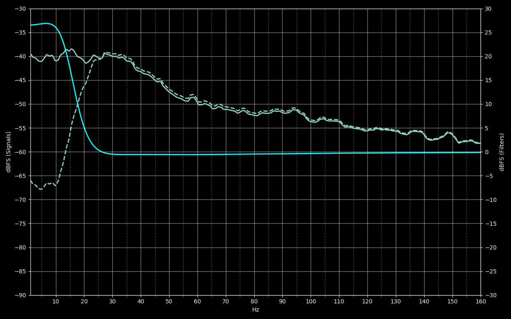
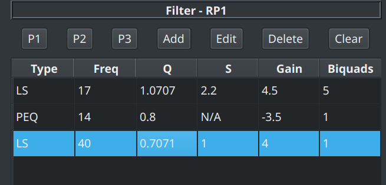
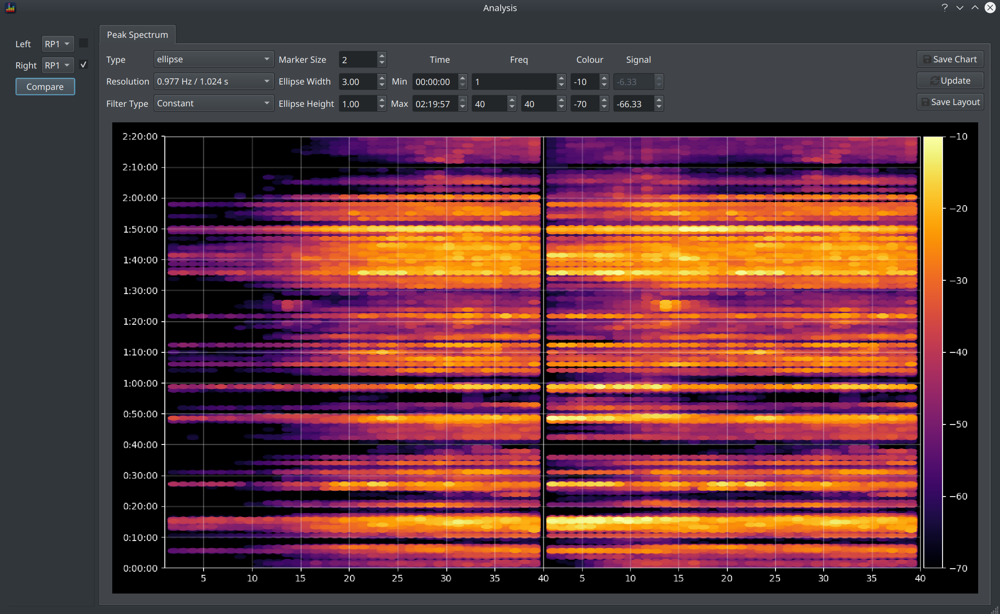
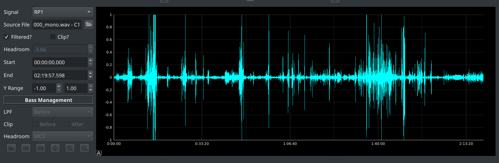

This section provides some guidance on the mechanics of using BEQDesigner to design a pre or post BM BEQ. It intends to tell you **how** to create a filter not **why** you should do or **what** sort of filter you should apply. 

Aspects like experimenting with filter types, deciding on target curves or subjective sound quality preferences are left as an exercise for the reader!

### Prerequisites

  1. You have BEQDesigner installed
  2. You have access to the movie you want to BEQ in a format that ffmpeg can read (e.g. mkv, bd folder)

### Workflow

#### Step 1: Extract Audio

Extract the audio track from the source file using [Extract Audio](../ui/extract_audio.md)

* Mix to Mono : Unchecked if creating a Pre BM BEQ, checked if creating Post BM BEQ
* Decimate : Checked

#### Step 2: Load Signal(s)

Load the signal(s) from the audio file created in Step 1 using the [Signal > Add](../ui/load_signal.md) button
Ensure the chart limits are set to show the [subwoofer range](../ui/main_window.md#controlling-graph-limits) and [smoothing](../ui/main_window.md#response-smoothing) is set to None.

#### Step 3: (Pre BM only) Group Channels

Inspect the peak and average curves for each channel. 
If multiple channels are at similar levels and have the same shape then [link them](../ui/main_window.md#linking-signals) as a master-slave group.

#### Step 4: Create Filters

Work on each individual channel, or group of channels if any are grouped, in turn. 

!!! tip
    When creating pre BM filters, remove the other signals from the application so the main chart is easier to read.
    
Inspect the peak and average curves to see where the rolloff begins and how steep it is. To illustrate, lets look at the mixed to mono response of Ready Player One:

We can see the response peaks at about 30Hz and falls by about 27dB down to 10Hz. Use the [Values dialog](../ui/main_window.md#magnitude-by-frequency) to get precise values.

!!! tip
    To calculate the slope in octave terms
    
        f1 = 30 Hz
        f2 = 10 Hz
        d = 27 dB
    
    $$
    slope = \frac{d}{\frac{log10(f1/f2)}{log10(2)}} 
          = \frac{27}{\frac{log10(3)}{log10(2)}} 
          = \frac{27}{1.58}
          = ~ 17 dB/octave
    $$

Our initial goal is to correct this rolloff so we need to apply a filter with a total gain of approx 27dB using an approximately 3rd order slope.

The slope of a shelf filter is governed by the `S` parameter so we want a shelf filter with an S >2 and <3 (S=1 is 1st order, S=2 is 2nd order and so on). 

!!! danger
    Try entering a low shelf with a gain of 27dB and S=3
    This is a completely unstable filter with the response utterly dominated by overshoot.

Keeping [the limitations of a shelf filter](#understanding-filter-shape) in mind, we'd probably aim slightly low with the S value so lets say try 5 S=2.5 with a gain of 5dB for a total target gain of 25dB and a centre frequency of 18Hz (i.e. somewhere around the middle of the rolloff).

This filter peaks at +28dB which is caused by the shelf filter overshooting.

Save the filter to see the effect on the signal itself, looking at average alone we see

This filter rises too much so we need to edit it, some options include:

* move the frequency up or down
* take steps to reduce Q (i.e. reducing gain and/or S)
* add PEQ to compensate for the overshoot

Some trial and error leads to

in which we have:

* reduced S to 2.2
* reduced total shelf gain to 22.5dB
* added a PEQ to reduce the overshoot at the top of the shelf

We seem to have fixed the rolloff but the undershoot at the bottom of the shelf has reduced the previous 30Hz peak. It is debatable whether this is a good or a bad thing but fortunately we have the tools to fix this if we want to. For example, by adding another compensating PEQ (to boost the depression) or a low S shelf filter. 

Here's an example

using S=1 +4dB low shelf filter to flatten it out

Now we've restored our 30Hz level while pulling up that 

!!! tip
    Use [Presets](../ui/presets.md) to store a few different filters so you can quickly switch back and forth to see the difference. 
    Remember that `CTRL+ALT+1` (or 2 or 3) saves a filter in a preset slot and `CTRL+SHIFT+1` (or 2 or 3) applies the filter from that slot.

#### Step 5: Optimise the Biquad Count

You may have used more biquads than your hardware can handle. This is particularly likely to be the case for minidsp 2x4 (non HD) users who can only use 6 biquads on the input channels.

If this is the case, take another pass over the filters to see if you can reduce the biquad count.
    
#### Step 6: Check for Noise

Open the [waveform view](../ui/waveform.md), select the channel you're working on from the *Signal* dropdown and open the [spectrum view](../ui/spectrum.md).

Configure as follows:

* select the same signal for comparison with a single checkbox checked
* set the frequency range to cover the area over which the filter is operating (1-40Hz in this case)
* set *Type* to Ellipse or Point
* set *Filter Type* to Constant

Now click *Compare*

It's clear that real signal is being boosted as we do not see a large expanse of a similar colour in the lower frequency range, instead we see existing big hits being extended <20Hz which is exactly the point of BEQ.
    
#### Step 7: Check Headroom

Return to the [waveform view](../ui/waveform.md) and check the *Filtered* checkbox. 

If *Headroom* is negative then a corresponding gain adjustment will be required to avoid clipping.

!!! info
    For Post BM BEQ, this is as simple as reducing the master volume by this amount.
    
    For Pre BM BEQ or for remuxing Post BM BEQ, you need to check headroom across all channels and then reduce all channels by the absolute max negative headroom value.
    
In our Ready Player One example, we see we need to reduce by ~4dB

#### Step 8: Demo!

If you're happy the shape looks ok then it's time to demo your work. 

!!! tip
    This is the fun part and also the most important part. As with everything in audio analysis, the goal is something that sounds really good not just a nice graph.

It's generally impractical to watch an entire film on every iteration of a filter so you need to take some shortcuts. One approach is to 

* pick a couple of scenes to cover some heavy hitters and some scenes with some more normal content
* dial in the filters to your DSP device 
* listen to both filtered and unfiltered audio tracks 

!!! tip
    Watch out for obnoxious and/or unnatural sounds which are likely to be more objectionable then the extra heft a good BEQ brings.

#### Step 9: Share

If you're happy with the results then create a [report](../ui/report.md) and share your work with the community! 
