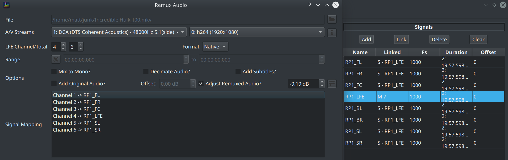

This section covers a few common scenarios for remuxing. Please read in conjunction with the [UI Guide](../ui/remux_audio.md) for full details on the remux dialog itself.

### Applying Post BM BEQ 

Remuxing a Post BM BEQ means applying that same filter to every single channel.

  1. Extract the audio track from the source file using [Extract Audio](../ui/extract_audio.md) with the following options
      * Mix to Mono : Unchecked
      * Decimate : Checked
  2. Load all channels from the resulting audio file into BEQDesigner as per [Load Signals](../ui/load_signal.md#loading-all-channels)
  3. Link all channels together so there is 1 master channel and all other channels are slaves
  
  4. Add the filter (to any signal) as per [Add Filter](../ui/add_filter.md)
  5. Open the [Remux dialog](../ui/remux_audio.md), set the following options
      * Select the correct video and audio tracks
      * Mix to mono : unchecked
      * Decimate audio : unchecked
      * All other options : set according to your own needs
  6. Check the "Adjust Remuxed Audio?" box and click the button next to it, the value may change to a negative number. 
      * Tweak this value, or the filters, if necessary as per [Avoiding Clipping](#avoiding-clipping)
  7. Check the filter to channel mapping is accurate, update if necessary.
  
  8. Set the output directory and file name
  9. Click remux and wait for it to complete

### Applying Pre BM BEQ

Remuxing a Pre BM BEQ means applying different filters to each channel (or groups of channels).

This means the process is the same as [the Post BM BEQ](#applying-post-bm-beq) except for link channels (i.e. step 3), only link channels into groups as specified by the Pre BM filter.

### Creating a Demo Clip

Demo clips can be created by applying filters (either pre or post BM BEQ) as per the above instructions while also

* Setting a time range to capture the demo clip only
* Checking the *Add Original Audio* box to allow you to flip back and forth between the original audio and the BEQ'ed track

Use the [spectrum view](../ui/spectrum.md) to help locate those heavy hitting moments which make good demo clips.

### Avoiding Clipping

Note the following when using the *Adjust Remuxed Audio* option

  1. The gain of each channel will be reduced by the specified amount. You will have to compensate by increasing the master volume in your playback system.
  2. If this value is large, it may indicate that the filter design is unrealistic and needs revisiting.
  3. This value comes from the [waveform view](../ui/waveform.md), check the *Filtered* checkbox and then look at the *Headroom* value on each channel to find which channel requires the most  attenuation to avoid clipping.
  4. BEQDesigner does not currently calculate the headroom required to avoid intersample clipping, adding 0.5dB more headroom should be sufficient to avoid this for the majority of cases.
